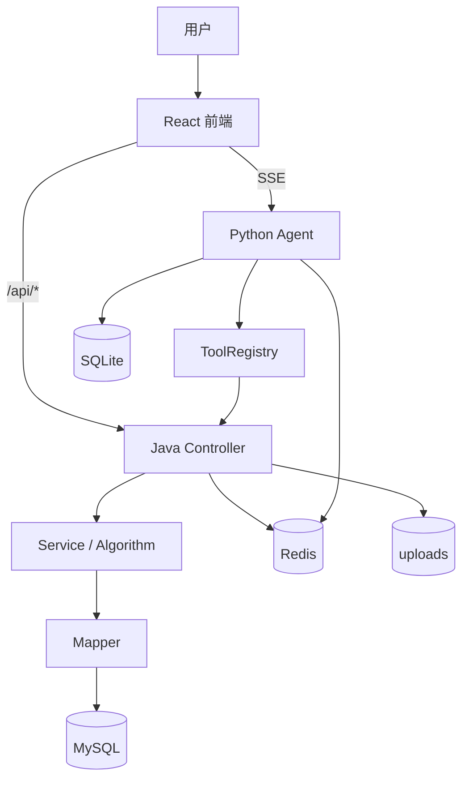

# 智能旅游系统各模块设计报告

> 用途：数据结构课程设计最终提交  
> 日期：2026 年 6 月 20 日  
> 组长：刘文涛  
> 事实依据：当前源码、SQL、Flyway、统一事实底稿及最新实跑结果

## 1. 引言

### 1.1 编写目的

本报告在总体方案基础上详细说明各模块职责、输入输出、接口、数据表、数据结构、算法、交互、异常、测试、状态和边界，为测试、评价改进、用户说明及 `report.docx` 提供模块级依据。

### 1.2 项目背景

项目面向校园、景区和城市旅游场景，采用 React、Spring Boot、FastAPI Agent、MySQL、Redis、SQLite 和本地文件存储，整合地点、路线、周边、日记、AI 写游记、XHS 和自然语言助手。

### 1.3 报告范围与依据

覆盖认证、地点、建筑设施、LBS、推荐、导航、美食、日记、AI 日记、周边、XHS、Agent、搭子、媒体、运行支撑和测试。设计以当前路由、Controller/Service/Mapper/Entity、Agent、SQL、测试和事实底稿为准。

## 2. 模块设计总览

### 2.1 划分原则

模块按用户流程、接口边界、业务实体、算法职责、Java 确定性业务与 Python 智能编排边界，以及课程验收场景划分。

### 2.2 模块总览表

| 编号 | 模块 | 用户价值 | 入口/组件 | 数据与算法 | 主责 | 状态与边界 |
|---|---|---|---|---|---|---|
| M-01 | 认证与基础设施 | 身份和个性化上下文 | 登录；Auth/Security | `sys_user`、JWT | 王博生 | 核心闭环；合同待统一 |
| M-02 | 地点浏览搜索详情 | 快速发现目的地 | 首页/搜索/详情；Place | place；Page、排序 | 王博生 | 核心闭环 |
| M-03 | 建筑设施 | 了解内部服务 | 详情；Building/Facility | building/facility | 王博生 | 核心闭环 |
| M-04 | LBS | 查找附近服务 | 详情/导航 | Haversine/Dijkstra | 刘文涛 | 依赖坐标和路网 |
| M-05 | 推荐排序 | 降低选择成本 | 首页/助手；推荐服务 | 相似度、Top-K/Treap | 刘文涛 | 课程设计级 |
| M-06 | 路线导航 | 安排游览路线 | 导航；Navigation/RouteAgent | 图、A*、Dijkstra、TSP | 刘文涛 | 依赖路网 |
| M-07 | 美食 | 查找餐饮 | 详情/助手；Food | food、排序 | 王博生/刘文涛 | 数据有限 |
| M-08 | 日记 | 记录旅行 | 日记页面；Diary | diary、AC、Huffman | 王博生/刘文涛 | 业务闭环，测试有缺口 |
| M-09 | AI 写游记 | 降低创作成本 | 助手/弹窗；DiaryAgent | tasks、LLM、媒体 | 胡文龙 | 依赖模型 |
| M-10 | 周边 | 查询生活服务 | 周边页；Surrounding | surrounding、Haversine | 刘文涛/王博生 | 数据质量分层 |
| M-11 | XHS | 外部热度参考 | 首页/详情；XHS 工具 | XHS 三表、Redis | 胡文龙 | 外部依赖 |
| M-12 | AI 助手 | 自然语言查询规划 | 助手；Agents/Tools | SQLite、ToolRegistry、SSE | 胡文龙 | 合同待加强 |
| M-13 | 出游搭子 | 个性化趣味 | BuddySelector | buddy/preferences | 胡文龙 | 基本可用 |
| M-14 | 文件媒体 | 图文与 AI 素材 | 上传/图片组件 | uploads、媒体数组 | 王博生/胡文龙 | 路径和重复风险 |
| M-15 | 运行支撑 | 可维护和容错 | Swagger/日志 | Result、异常、fallback | 王博生 | 可用，观测需增强 |
| M-16 | 测试验收 | 支撑课程验收 | test/build/health | JUnit、pytest、H2 | 三人协作 | 非全绿 |

### 2.3 模块关系图

Java 是业务数据权威层；Agent 通过 `tourism_api` 调 Java；Redis 主要支撑 XHS，SQLite 仅保存 Agent 本地状态。

## 3. M-01 认证与统一基础设施

- **目标与价值：** 完成身份识别和个性化上下文。
- **入口/组件：** 登录页、个人中心；`AuthController`、`AuthService`、Security、JWT Filter。
- **数据/结构：** `sys_user`；JWT Header/Payload/Signature、SecurityContext、`Result<T>`。
- **接口：** `/api/auth/register`、`/login`、`/me`。
- **流程：** 凭据提交→BCrypt 校验→签发 JWT→携带 Token→Filter 恢复 Principal。
- **异常与安全：** 重名、密码错误、Token 失效、未授权；部分公开接口和 HTTP 状态码仍需统一。
- **测试/状态：** 认证主链可用；相关旧测试期望存在差异。
- **贡献：** 王博生主责前后端联调；刘文涛（组长）参与测试问题和文档整理。

## 4. M-02 地点浏览、搜索与详情

- **价值：** 快速查找并了解目的地。
- **入口/组件：** 首页、搜索、详情；`PlaceController/Service/Mapper`、`SpotPlace`、`PlaceDetailVO`。
- **数据：** `spot_place` 约 301 条，可聚合 building、facility、XHS。
- **结构算法：** `Page<T>`、List、JSON keywords/features、Wrapper、LIKE、热度/评分排序。
- **输入输出：** page/size/type/query/id→分页列表或聚合详情。
- **异常：** 无数据返回空；XHS 聚合失败不阻塞基础详情。
- **性能：** 分页减小传输；排序依数据库索引。
- **状态/边界：** 核心闭环；覆盖和坐标质量影响结果。
- **贡献：** 王博生主责页面与接口；刘文涛负责数据/算法说明；胡文龙接入 Agent 查询。

## 5. M-03 建筑与设施查询

- **价值：** 查看校园/景区内部建筑和服务。
- **组件/数据：** `BuildingController`、`FacilityController` 及 Service/Mapper；building 约 63、facility 约 204。
- **结构算法：** List、type 分类、Wrapper 条件筛选与排序。
- **交互：** 地点详情按 placeId 聚合；设施可作为附近与路线节点。
- **异常：** 无记录展示空状态。
- **边界：** 旧设施页未独立挂载时不作为正式入口。
- **贡献：** 王博生主责联调；刘文涛负责数据字典和算法说明。

## 6. M-04 LBS 附近设施

- **输入输出：** lat、lng、radius、type→设施及距离。
- **数据：** `spot_facility`，可扩展 `spot_surrounding`。
- **算法：** Haversine 单次 `O(1)`；候选扫描 `O(n)`、排序 `O(n log n)`；可用 Dijkstra 求路网可达距离。
- **设计：** 图计算失败时回退直线距离并标识方式。
- **边界：** 直线距离不等于步行距离；大规模需 GIS/空间索引。
- **贡献：** 刘文涛主责算法分析；王博生参与接口联调。

## 7. M-05 推荐与排序

- **价值：** 从地点、日记和美食中发现热门或匹配兴趣内容。
- **数据/结构：** user、behavior、place、diary；HashMap 稀疏向量、List、Treap/Top-K。
- **算法：** 余弦、Jaccard、协同过滤、TF-IDF、热度评分；相似度单候选 `O(D)`，全排 `O(n log n)`，Top-K 平均 `O(n log k)`。
- **降级：** 无画像时回退热门/高评分。
- **状态：** 课程设计级混合推荐；行为稀疏和标签质量限制效果。
- **贡献：** 刘文涛主责算法实现和论证；王博生负责展示与接口。

## 8. M-06 路线规划与导航

- **价值：** 规划单点、多点和室内外路线。
- **组件/数据：** `NavigationController`、路线 Service/算法类；road_edge 约 483，地点/建筑/设施坐标及 indoor JSON。
- **结构：** 图、邻接表 `O(V+E)`、PriorityQueue、路径节点 List。
- **算法：** Dijkstra `O((V+E)logV)`；A* 最坏近 Dijkstra；TSP DP `O(n²2ⁿ)`，较大目标集用启发式。
- **输出：** 节点、分段、距离、时间或不可达。
- **边界：** 依赖路网、坐标和 Provider；Agent 路线参数合同仍需加强。
- **贡献：** 刘文涛主责算法；王博生负责接口和页面；胡文龙负责 Agent 路线入口。

## 9. M-07 美食查询

- **组件/数据：** Food Controller/Service/Mapper，`spot_food` 约 40 条。
- **结构算法：** 分页、菜系条件、热门/距离排序、Top-K。
- **入口：** 地点详情、搜索和 Agent。
- **异常：** 覆盖不足返回空。
- **边界：** 餐厅领域模型有限；Agent 分页返回合同需统一。
- **贡献：** 王博生负责接口，刘文涛负责数据与排序，胡文龙负责 Agent 工具。

## 10. M-08 旅行日记

- **入口/组件：** 日记列表、详情、我的日记、管理；Diary Controller/Service/Mapper。
- **数据结构：** `travel_diary` 约 14 条种子、behavior；`Page<T>`、JSON images/videos/tags、时间与热度序列。
- **算法：** AC 自动机 `O(L+z)` 过滤敏感词；Huffman 构树 `O(σlogσ)`、编解码 `O(L)`；搜索和推荐。
- **流程：** 输入→校验→AC→文本封装→保存→列表/详情。
- **异常：** 权限、空正文、资源不存在。
- **状态：** 业务闭环；H2 Schema 漂移导致部分测试失败。
- **贡献：** 王博生主责前后端；刘文涛主责 AC/Huffman；胡文龙参与 AI 保存链。

## 11. M-09 AI 辅助写游记

- **组件：** AI 助手、日记弹窗；DiaryAgent、ChatAgent、model router、LLM client；Java 日记接口。
- **存储/结构：** diary、SQLite tasks/preferences、uploads；任务状态、消息上下文、图片列表和生成对象。
- **流程：** 文本/图片→意图→风格确认→文本/视觉模型→标题正文标签→用户确认→保存。
- **异常/降级：** 视觉不可用回退文本；生成失败返回错误；AI 内容需人工确认。
- **边界：** DeepSeek 不承担图片理解；视觉依赖 Key、网络和图片 URL/base64。
- **贡献：** 胡文龙主责 Agent 链；王博生负责前端发布；刘文涛负责文档边界。

## 12. M-10 校园 / 景区周边

- **入口/组件：** 周边页、地点详情；Surrounding Controller/Service/Mapper。
- **数据：** `spot_surrounding`；六类 service type。
- **结构算法：** Page、分类、标签、坐标；Haversine、分类统计、评分/距离排序。
- **边界：** 北邮 POI 相对可靠；批量景区数据存在生成、乱码、重复和来源风险。
- **贡献：** 刘文涛主责数据库与质量；王博生负责页面接口；胡文龙接入 Agent。

## 13. M-11 小红书热门与同步

- **组件：** 首页/详情/个人中心；XHS Controller/Service；xhs tool/client/scraper。
- **数据：** `spot_xhs_info`、`user_xhs_account`、`xhs_publish_log`、Redis。
- **结构：** 热度、摘要、标签、账号状态、日志、TTL 和限流键。
- **流程：** 刷新→外部平台→解析→MySQL/Redis→展示。
- **验证：** 运行时识别 43 个方法；测试 29/33。
- **边界：** Cookie、平台、账号和缓存依赖；不保证稳定抓取/发布。
- **贡献：** 胡文龙主责工具链；王博生参与入口和接口；刘文涛负责表和风险说明。

## 14. M-12 AI 旅游助手与 Agent

- **组件：** 助手页；FastAPI、Dispatcher/Orchestrator、Chat/Route/Diary Agent、ToolRegistry、tourism_api、SQLite、trace。
- **结构：** AgentContext、哈希工具注册平均 `O(1)`、JSON Tool Call、sessions/messages、SSE。
- **流程：** 消息→SSE→意图/槽位→Agent→工具→Java→LLM→token/tool/done/error。
- **异常：** 工具失败、模型超时、缺槽位和空数据均应提示或降级。
- **边界：** LLM 不确定；Python 直连 user_id 和跨服务合同需加强。
- **贡献：** 胡文龙主责全流程；王博生负责前端适配；刘文涛负责算法和文档说明。

## 15. M-13 出游搭子与创新交互

- **数据/结构：** SQLite `user_buddy`、`user_preferences`；人格配置、偏好和会话上下文。
- **设计：** 预设/自定义搭子写入 Prompt，影响语气与关注点。
- **状态：** 搭子基本可用；扔骰子、场景推荐等为后续方向。
- **贡献：** 胡文龙主责；王博生参与前端美化；刘文涛负责报告说明。

## 16. M-14 文件、图片与媒体

- **组件/存储：** 上传 API、图片组件、uploads/images、videos 和 GIF。
- **结构：** 路径、媒体数组、标签和业务关联字段。
- **异常：** 类型/大小非法、缺图、重复、路径不可访问。
- **降级：** fallback、隐藏损坏图片；云视觉无法访问 localhost 时跳过视觉。
- **边界：** convert-to-video 实际为 GIF 动画合成。
- **贡献：** 王博生负责上传展示；胡文龙负责 AI 图片链；刘文涛负责质量说明。

## 17. M-15 统计、异常、降级与运行支撑

- **组件：** Stats、GlobalExceptionHandler、`Result<T>`、Swagger、日志、health、前端 safe/fallback。
- **结构：** 统一响应、错误对象、统计 Map 和日志事件。
- **容错：** 空状态、图片 fallback、Redis/XHS/模型失败降级、路线不可达提示。
- **边界：** 前端安全返回可能掩盖后端错误，需增强可观测性。
- **贡献：** 王博生主责运行联调；刘文涛整理测试问题；胡文龙负责 Agent trace 与降级。

## 18. M-16 测试与验收支撑

当前三端健康检查均为 200；前端 build 成功；MySQL 数据与 Flyway 成功；Redis `PONG`；Java 126/132；XHS 29/33；lint 8 错误、4 警告。剩余问题属于代码、H2 Schema 或旧契约，不是环境缺失，不能写全部通过。

验收手段包括页面、Swagger、数据库、Agent 对话、SSE、JUnit/pytest、日志、Trace 和截图。刘文涛（组长）主责测试问题和报告，王博生主责运行工程，胡文龙主责 Agent/AI 验证。

## 19. 模块接口设计汇总

| 模块 | 入口 / 组件 | 主要路径 | 方法与输入 | 返回 / 数据 | 登录与异常边界 |
|---|---|---|---|---|---|
| Auth | 登录/个人中心；Auth | `/api/auth/**` | POST 凭据、GET me | `Result<LoginVO/User>`、user | 登录注册公开；错误状态码待统一 |
| Place | 首页/搜索/详情；Place | `/api/places/**` | GET page/query/type/id/limit | Page/Detail；place | 查询公开；无数据为空 |
| Building | 详情；Building | `/api/buildings/**` | GET placeId/id/type | List/Detail；building | 空结果 |
| Facility | 详情/导航；Facility | `/api/facilities/**` | GET placeId/type/坐标/radius | 设施及距离；facility | 参数、不可达 |
| Navigation | 导航；Navigation | `/api/navigation/**` | GET/POST start/end/destinations/algorithm | 路径、距离、时间；road | 路网不足 |
| Food | 详情/助手；Food | `/api/foods/**` | GET page/placeId/cuisine/limit | 列表/详情；food | Agent 字段合同 |
| Diary | 日记页；Diary | `/api/diaries/**` | CRUD、评分、点赞 | Diary/Page；diary/behavior | 写权限、H2 漂移 |
| Surrounding | 周边页；Surrounding | `/api/surroundings/**` | GET/POST place/type/query/坐标 | Page/Detail；surrounding | 编码和空数据 |
| XHS | 首页/个人中心；XHS | `/api/xhs/**` | GET/POST place/user/diary | 热度/状态/日志 | Cookie、权限和平台 |
| Upload | 上传组件；Media | `/api/upload/**` | multipart | 资源路径；uploads | 文件类型/写盘 |
| Agent | 助手；Agent | `/api/agent/**`、`/agent/**` | POST message/session/images；SSE | token/tool/done/error；SQLite | Java 代理覆盖和鉴权 |
| Algorithm | 演示入口 | `/api/algorithm/**` | 数组、文本、算法参数 | 算法结果 | 课程演示，不等同业务主链 |

接口统一使用 `Result<T>`；分页字段、参数名称和错误语义需在前端、Java 与 Agent 间继续收敛。

## 20. 模块数据结构与算法汇总

| 模块 | 表 / 存储 | Entity / DTO / VO | 结构 / 算法 | 输入 → 输出 | 复杂度 / 状态 / 边界 |
|---|---|---|---|---|---|
| 认证 | user | SysUser、LoginDTO/VO | JWT、SecurityContext | 凭据→Token | 近线性于 Token；权限需加固 |
| 地点 | place | SpotPlace、PlaceDetailVO | Page、JSON、Wrapper、排序 | 条件→列表/详情 | 依索引；核心闭环 |
| LBS | facility/surrounding | SpotFacility/Surrounding | Haversine | 坐标→距离 | 单次 `O(1)`、扫描 `O(n)` |
| 推荐 | user/behavior/place/diary | 业务对象 | HashMap、余弦、Jaccard、CF、Top-K/Treap、TF-IDF | 特征→候选 | `O(n log k)` 等；课程级 |
| 路线 | road/indoor | RoadEdge、Route DTO | 图、邻接表、PQ、Dijkstra、A*、TSP | 节点→路径 | `O((V+E)logV)`；依赖路网 |
| 日记 | diary/behavior | TravelDiary | Page、JSON、AC、Huffman | 正文→安全封装 | AC `O(L+z)`；Huffman `O(L)` |
| Agent | SQLite/Java | AgentChatRequest/Schema | AgentContext、ToolRegistry、SSE | 消息→流式回复 | 工具查找 `O(1)`；合同风险 |
| XHS | XHS 三表/Redis | SpotXhsInfo 等 | TTL 缓存、限流、标签列表 | 外部数据→缓存 | 命中近 `O(1)`；平台依赖 |
| 搭子 | SQLite | buddy/preference rows | 人格配置、会话上下文 | 设置→Prompt | 基本可用 |
| 媒体 | uploads/JSON | 文件结果对象 | 路径 List、GIF | 文件→URL/GIF | I/O 相关；重复风险 |
| 算法演示 | 内存 | Algorithm DTO | Fibonacci Heap 等 | 键值→操作结果 | 有测试，非路线主优先队列 |

## 21. AI / 智能体辅助模块设计说明

### 21.1 模块划分

AI 辅助阅读 `App.jsx`、Controller、Service、SQL、Agent Tool 和事实底稿，形成模块边界；人工依据真实路由和类文件删除未挂载或方案级能力。

### 21.2 详细设计

AI 辅助整理模块职责、接口、数据表、输入输出、异常和降级；王博生从前后端可实现性核验，刘文涛从数据库、算法与文档核验，胡文龙从 Agent 链路核验。

### 21.3 算法与性能

AI 辅助比较 Dijkstra/A*、TSP 精确/启发式、Top-K/全排、AC/逐词匹配和规则助手/LLM+Tools；最终复杂度和接入状态由算法源码与测试确认。

### 21.4 代码与测试

AI 可辅助 Controller、Service、页面、Agent Tool、SQL、测试和 Bug 分析，但生成结果必须人工审查、编译、运行和复测，不以生成内容代替通过证据。

### 21.5 文档撰写

AI 辅助生成初稿和表格；刘文涛（组长）主责报告与算法论证，王博生核对前后端和仓库事实，胡文龙核对 Agent 与 AI 边界。

## 22. 成员分工与模块贡献说明

### 22.1 综合贡献表

| 成员 | 职责定位 | 主责模块 | 主要贡献 | 算法 / 结构 | 测试与文档 | 权重 |
|---|---|---|---|---|---|---:|
| 王博生 | 前后端与仓库 | M-01～03、部分 M-07/08/14/15 | 页面、Java 接口、数据适配、脚本和仓库 | Page、REST、状态结构 | 运行联调、归档、演示 | 约三分之一 |
| 刘文涛（组长） | 数据库、算法、报告与协调 | M-04～06、数据库、文本算法、M-16 文档 | SQL/Flyway、数据字典、核心算法和复杂度、报告 | 图、Dijkstra、A*、TSP、Haversine、Top-K、Treap、TF-IDF、CF、AC、Huffman | 测试问题、报告主体、一致性 | 约三分之一 |
| 胡文龙 | Agent 全流程与前端美化 | M-09、M-11～13、Agent 相关 | Agent、Tools、SSE、SQLite、AI/XHS 和页面体验 | ToolRegistry、AgentContext、SSE、意图/槽位、任务状态 | Agent 测试、AI 验收、边界说明 | 约三分之一 |

权重仅说明职责侧重，不代表机械工作量或主观排名。

### 22.2 模块主责映射

| 模块 | 主责 | 协作 | 说明 |
|---|---|---|---|
| 认证/地点/建筑设施 | 王博生 | 刘文涛 | 工程主链；数据和文档协作 |
| LBS/推荐/路线 | 刘文涛 | 王博生、胡文龙 | 算法主责；接口与 Agent 入口协作 |
| 美食/周边 | 王博生、刘文涛 | 胡文龙 | 页面接口与数据算法；Agent 接入 |
| 日记 | 王博生、刘文涛 | 胡文龙 | 前后端、文本算法、AI 保存链 |
| AI 日记/Agent/搭子/XHS 工具 | 胡文龙 | 王博生、刘文涛 | 智能体主责；页面、数据和报告协作 |
| 媒体 | 王博生、胡文龙 | 刘文涛 | 上传展示、AI 图片、质量说明 |
| 测试和文档 | 刘文涛（组长） | 王博生、胡文龙 | 报告/算法、运行工程、Agent 验证 |

### 22.3 分工边界

三人职责有主次但存在交叉联调；不机械平均，不夸大单人成果。主报告需明确三人职责和贡献权重。

## 23. 模块测试与验收标准

| 模块 | 验收方式 | 预期结果 | 依赖 | 当前状态 / 风险 |
|---|---|---|---|---|
| M-01 | 页面/REST/测试 | 注册登录、JWT | user/JWT | 可用；合同差异 |
| M-02 | 页面/Swagger/DB | 分页搜索详情 | place | 核心闭环 |
| M-03 | REST/详情 | 建筑设施查询 | building/facility | 空数据正常 |
| M-04 | 坐标手测 | 半径与距离 | 坐标 | 直线/路网边界 |
| M-05 | REST/算法测试 | 有序候选和回退 | 行为标签 | 数据稀疏 |
| M-06 | 导航页/REST | 路径或不可达 | road/坐标 | 路网与合同 |
| M-07 | REST/Agent | 美食筛选 | food | 数据/字段有限 |
| M-08 | 页面/CRUD/测试 | 日记全流程 | diary/user | H2 漂移 |
| M-09 | SSE/手工发布 | 生成并确认保存 | LLM/视觉 | 模型依赖 |
| M-10 | 页面/REST/DB | 分类、距离、详情 | surrounding | 数据质量 |
| M-11 | REST/Redis/测试 | 有缓存展示、无数据降级 | Cookie/平台 | 29/33 |
| M-12 | 对话/SSE/Trace | 意图、工具、流式 | Agent/Java | 合同风险 |
| M-13 | 页面/SQLite | 搭子影响对话 | SQLite | 基本可用 |
| M-14 | 上传/文件 | 上传、展示、fallback | 文件权限 | 重复/路径 |
| M-15 | health/log/Swagger | 错误可定位 | 全环境 | 观测需增强 |
| M-16 | build/test/截图 | 结果可复现 | 完整环境 | Java 126/132；lint 遗留 |

## 24. 风险、边界与后续优化

| 模块 | 风险 | 当前事实 | 影响 | 优化与口径 |
|---|---|---|---|---|
| 地点/周边 | 数据覆盖/乱码 | 数据质量分层 | 空结果或失真 | 质量检查；不称全真实 |
| 路线 | 路网坐标 | 约 483 边 | 不可达 | GIS/连通检查；不称任意城市 |
| Agent | Java 合同 | 参数/字段错位 | 工具失败 | OpenAPI 契约测试 |
| XHS | Cookie/平台 | 外部变化 | 刷新发布失败 | 缓存降级；不称稳定 |
| AI 日记 | 视觉模型 | Key/网络/图片 | 理解失败 | 文本回退 |
| XHS | Redis | 增强依赖 | 缓存/限流异常 | 熔断；非核心全局依赖 |
| 基础设施 | 密钥/权限 | 白名单和默认配置风险 | 越权 | 环境变量、服务鉴权 |
| 日记测试 | H2/MySQL | Schema 漂移 | 失败/假通过 | 同步迁移/Testcontainers |
| 前端 | fallback/旧页面 | 可能掩盖错误 | 观测不足 | 错误分类；以 App 路由为准 |
| 媒体 | 重复/路径 | 未全量治理 | 缺图/重复 | 哈希去重和 URL 规范 |
| 媒体 | GIF 命名 | 非生成式视频 | 能力误解 | 明确“GIF 动画合成” |
| 质量 | lint/test | lint 8/4、测试非全绿 | 验收扣分 | 修复并 CI；如实记录 |

## 25. 与其他专项报告及课程设计主报告的关系

1. **开发任务报告：** 本报告把任务拆到模块、类、数据和算法。
2. **功能需求报告：** 需求回答“做什么”，本报告回答“如何实现”。
3. **总体方案报告：** 总体方案给出全局架构，本报告细化组件与流程。
4. **数据结构和数据字典：** 本报告提供各模块使用表、实体和算法的索引。
5. **测试报告：** 第 23 章提供模块验收对象和预期。
6. **评价改进报告：** 第 24 章提供问题与优化来源。
7. **用户说明：** 模块入口与流程可转化为用户操作步骤。
8. **主报告 `report.docx`：** 本报告是“完成功能”“架构细化”“算法与性能”“测试结果”“运行截图”和“成员贡献”的重要素材。主报告应提炼模块、接口、算法、贡献与边界，不完整复制全文。

## 26. 总结

本报告按模块说明了认证、地点、设施、推荐、路线、美食、日记、AI 写游记、周边、XHS、Agent、媒体和测试支撑，并从入口、接口、表、结构、算法、异常、测试和边界展开。系统体现图、路径搜索、推荐、文本处理、分页、JSON、Redis、ToolRegistry 和 SSE 等课程设计内容。

AI 辅助模块划分、接口分析、算法比较、测试定位和文档生成，最终由人工核验。成员分工统一为：王博生主责前后端与仓库，刘文涛担任组长并主责数据库、算法和报告，胡文龙主责 Agent 全流程与前端美化；三人贡献总体相当。当前系统可运行但仍有测试契约、lint、数据质量、外部平台、多模态和权限边界问题。

## 最终交付内容

本报告最终交付报告正文、核心表格、模块关系与流程图、AI/智能体辅助说明、成员分工与贡献说明、风险边界、与其他专项报告及课程设计主报告的关系，以及可供 `report.docx` 提炼的关键素材。特有交付项包括模块总览表、模块关系图、各模块详细设计、接口汇总表、数据结构与算法汇总表、测试与验收标准表及模块主责映射表。
