# 智能旅游系统总体方案设计报告

> 报告用途：数据结构课程设计最终提交  
> 编制日期：2026 年 6 月 20 日  
> 事实依据：当前源码、SQL、Flyway、统一事实底稿及最新运行与测试结果  
> 状态口径：已形成核心闭环 / 基本可用但依赖数据或配置 / 演示级或课程设计级 / 方案级或后续优化 / 存在遗留问题

## 1. 引言

### 1.1 编写目的

本报告用于说明智能旅游系统的总体设计方案，包括设计目标、原则、技术选型、开发模式、逻辑和物理架构、数据架构、前端、Java 后端、Python Agent、接口、核心流程、算法、性能、安全、容错、部署和能力边界，为数据结构和数据字典、模块设计、测试报告、评价改进及用户说明提供总体依据。

### 1.2 项目背景

旅游、校园参观和景区游览中存在地点信息分散、路线安排困难、周边服务查询不便、旅行记录和内容创作成本较高等问题。项目选择智能旅游系统作为课程设计对象，将地点、路线、设施、周边、美食、日记、小红书外部内容和 AI 助手统一到多服务全栈系统中，并把课程算法用于真实业务。

### 1.3 设计范围

本报告覆盖总体目标与原则、技术选型、开发模式、逻辑架构、部署拓扑、数据架构、前端和后端方案、Agent 编排、REST/SSE 接口、九类核心流程、算法性能、安全容错、测试运行、AI 辅助设计、截图规划、创新价值和风险优化。

### 1.4 设计依据

设计依据包括课程要求、`PROJECT_FACT_BASE_FOR_REPORTS_2026-06-20.md`、当前 React/Java/Python 源码、SQL 与 Flyway、测试源码和实跑结果、Week 5—15 开发记录、Bug/Fix/Root Cause、自评表及验收指导稿。材料冲突时以当前源码和最新实跑为准。

## 2. 总体设计目标与原则

### 2.1 总体设计目标

1. 构建可运行、可演示、可解释的智能旅游系统；
2. 支持认证、地点、路线、建筑设施、周边、美食、日记和 AI 助手；
3. 以 MySQL 保存业务数据、Redis 支撑增强缓存、SQLite 保存 Agent 状态；
4. 采用 React、Spring Boot 和 FastAPI 三服务架构；
5. 将图搜索、推荐排序、文本处理、缓存和工具调用纳入总体方案；
6. 支持课程验收所需的功能、算法、测试、运行和文档说明；
7. 明确外部平台、模型、数据质量和测试遗留边界。

### 2.2 设计原则

| 原则 | 方案体现 |
|---|---|
| 分层解耦 | 前端表现、Java 确定性业务、Python 智能编排、数据存储和外部能力分层 |
| 前后端分离 | React 通过 REST/SSE 消费服务，不直接访问数据库 |
| 数据驱动 | 地点、路线、推荐和周边结果以数据库数据为基础 |
| 算法可解释 | 对输入、输出、数据结构、复杂度和边界进行说明 |
| AI 辅助不替代事实 | LLM 负责理解与生成，业务事实以 Java 和数据库为准 |
| 可测试可运行 | 提供 JUnit、pytest、build/lint、Swagger、健康检查和启停脚本 |
| 可扩展 | Controller/Service、Agent Tool、表和模块可按业务扩展 |
| 降级容错 | 空数据、缺图、Redis/XHS/视觉失败时提供回退或提示 |
| 安全边界清晰 | JWT、BCrypt、环境变量和 Cookie 加密，同时披露现有权限缺口 |
| 课程设计适配 | 优先保证算法实践、单机演示、文档解释和可验收性 |

### 2.3 方案状态分层

“核心闭环”表示页面、接口、数据和业务已贯通；“基本可用”表示依赖特定数据或配置；“演示级”表示适合课程展示但未形成稳定产品能力；“方案级”表示尚待完整落地；“遗留问题”表示测试、合同、数据或安全问题仍需修复。后文均采用此口径。

## 3. 系统总体架构设计

### 3.1 总体架构概述

系统采用 React + Vite 前端、Spring Boot Java 主业务服务、Python FastAPI Agent 服务的三服务架构。MySQL 是业务主库，Redis 支撑 XHS 缓存和限流，SQLite 保存 Agent 会话与任务，本地 `uploads` 保存媒体。外部能力包括文本/视觉模型、小红书和可选地图服务。

### 3.2 总体架构图

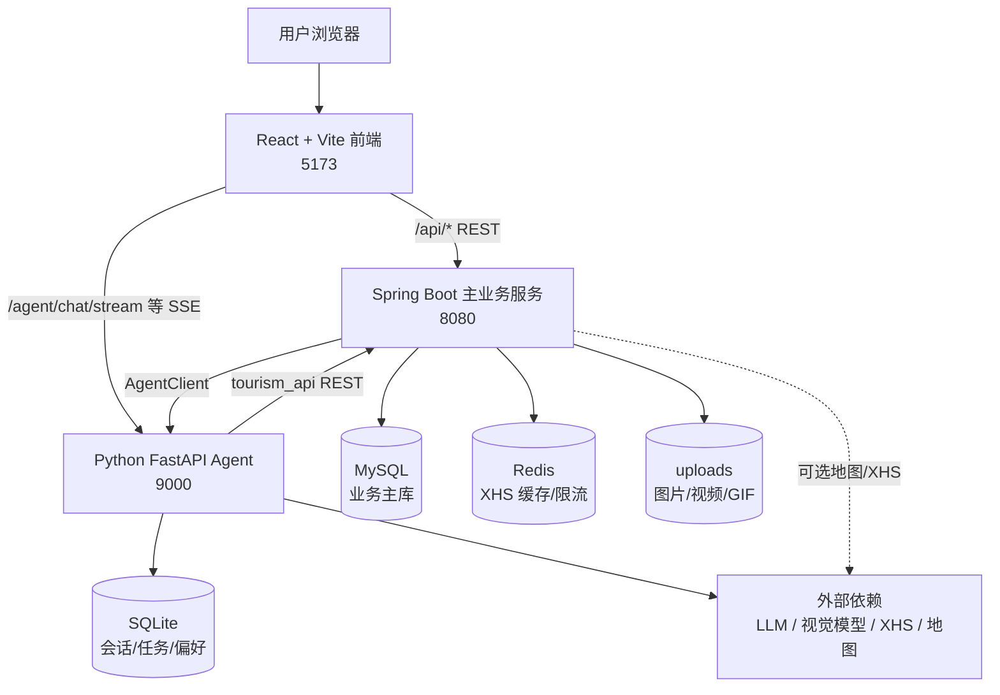

Redis 不是地点、日记等全部核心查询的必需条件；外部模型和平台属于增强依赖。

### 3.3 架构分层

1. **表现层：** React 页面、路由、组件、API 服务、卡片、表单、地图、AI 助手、日记和周边页面。
2. **业务服务层：** Java Controller、Service/ServiceImpl、Mapper、Entity、DTO/VO、统一返回、异常和安全。
3. **智能编排层：** FastAPI、Dispatcher/Orchestrator、Chat/Discover/Route/Diary Agent、ToolRegistry、SSE 和 LLM。
4. **数据持久层：** MySQL、SQLite、Redis 和文件系统。
5. **外部能力层：** 文本模型、视觉模型、小红书和地图 Provider。

### 3.4 架构选择理由

React 适合复杂交互、组件复用和流式状态更新；Spring Boot 适合稳定 REST、数据库事务、鉴权和确定性业务；Python FastAPI 便于异步 LLM 调用、Agent 编排与工具扩展；MySQL 适合结构化关联数据；Redis 适合短生命周期缓存和限流；SQLite 适合单机 Agent 的轻量状态持久化。该方案把确定性业务逻辑与概率性 AI 能力隔离，便于降级和事实控制。

### 3.5 架构边界

Agent 不替代 Java 权威数据层；LLM 输出具有不确定性；路线依赖地点、坐标和 `spot_road_edge`；XHS 和视觉模型依赖外部配置；Python 直连端点的 `user_id` 信任边界需加强；`tourism_api` 与 Java 的部分参数和返回字段需契约测试。

## 4. 技术选型方案

### 4.1 技术选型总览

| 层次 | 技术 | 作用 | 选择理由 | 状态与边界 |
|---|---|---|---|---|
| 前端 | React | 页面和组件 | 组件化、状态交互 | 核心页面可用 |
| 构建 | Vite | 开发与生产构建 | 启动快、配置轻量 | build 成功；lint 有遗留 |
| 主语言 | Java 17 目标 / Java 21 实跑 | 主业务和算法 | 类型安全、生态成熟 | 测试 126/132 |
| 框架 | Spring Boot 3.3.5 | REST、配置和分层 | 快速构建业务服务 | 核心闭环 |
| 安全 | Spring Security + JWT + BCrypt | 鉴权与密码保护 | 无状态认证 | 白名单和默认配置需加固 |
| ORM | MyBatis-Plus | CRUD、分页、条件查询 | 降低模板代码 | 广泛接入 |
| 迁移 | Flyway | 数据库版本管理 | 迁移可追踪 | 已在 MySQL 成功执行 |
| 接口 | Swagger | API 查看与手工验证 | 便于联调验收 | 可访问 |
| 主库 | MySQL 8.4 | 业务持久化 | 结构化关系数据 | 已初始化 |
| 缓存 | Redis 8.8 | XHS 缓存和限流 | 低延迟键值访问 | `PONG`；非全部核心必需 |
| Agent | Python FastAPI | LLM 和工具编排 | 异步、Python AI 生态 | 服务健康 |
| Agent 状态 | SQLite WAL | 会话、消息、任务、偏好 | 轻量单机持久化 | 基本可用 |
| 流式交互 | SSE | token 与工具事件 | 浏览器原生单向流 | 已接入 |
| 模型 | OpenAI-compatible Client | 文本理解和生成 | 可配置模型端点 | Key 环境变量复用 |
| 视觉 | 可选视觉模型 | 图片理解 | 多模态增强 | 依赖 Key、网络和图片 |
| 外部内容 | XHS 运行时 | 热度、笔记、发布 | 内容增强 | 43 个方法；平台依赖 |
| 文件 | 本地 uploads | 媒体资源 | 课程环境部署简单 | 需去重、权限和备份 |

### 4.2 前端选型

前端以 React 组件化承载搜索、详情、日记、导航、周边和助手，使用 `services/api` 封装 HTTP，并处理 SSE、加载、空状态和图片回退。Vite 生产构建成功；当前 lint 仍有 8 个错误和 4 个警告。

### 4.3 Java 后端选型

Spring Boot 作为主业务服务，MyBatis-Plus 提供分页和动态查询，Security/JWT 建立身份，Flyway 管理迁移，Swagger 支撑验收，`Result<T>` 和全局异常统一返回。当前后端 126/132 通过，H2 Schema 和状态码合同仍需治理。

### 4.4 Agent 选型

FastAPI 适合异步接口和模型调用；Dispatcher/Orchestrator 负责意图路由；ToolRegistry 管理 Function Calling 工具；SSE 提供流式体验；SQLite 保存本地状态。模型和工具链为增强能力，Agent—Java 合同仍需加强。

### 4.5 数据与缓存选型

MySQL 保存关系业务数据，Redis 保存 XHS 缓存和限流键，SQLite 保存 Agent 状态，`uploads` 保存媒体，JSON 字段保存兴趣、标签、图片和交通方式等扩展结构。该组合适合课程单机环境，但需处理多存储一致性和备份。

### 4.6 技术风险

三服务比单体部署复杂；LLM、视觉、XHS 和地图受网络及配置影响；H2 与 MySQL 存在结构漂移；Redis 不应成为基础浏览的单点依赖；前端 lint、跨服务合同和权限边界仍需修复。

## 5. 系统开发模式设计

### 5.1 开发模式

项目采用前后端分离、Java 主业务 + Python Agent、数据库驱动、接口先行与页面联调并行、周报式迭代、Bug/Fix/Root Cause 驱动修复，以及 AI 辅助、人工核验的开发模式。

### 5.2 开发过程模型

开发过程依次经历数据库底座、认证和基础查询、页面联调与响应收敛、Service/推荐/LBS/路线算法、Agent 与 AI 日记、周边和 XHS 扩展、测试修复与文档验收。早期周报只代表当时状态，不反向覆盖最终代码。

### 5.3 分层开发方式

Java 按 Controller—Service—Mapper—Entity 组织，并使用 DTO/VO、Config、Security、Utils 和 Algorithm；前端按 pages、components、services/api 和 hooks 组织；Agent 按 agent、core、tools、db 和 skills 组织；数据库分 schema、种子、迁移和测试数据；测试与文档随迭代补充。

### 5.4 AI / 智能体辅助模式

AI 用于阅读源码、建立事实底稿、辅助架构和模块拆分、生成接口/测试/SQL/文档建议、比较算法，并分析路线、Agent 工具、周边乱码、图片重复、XHS 和日记图片问题。所有输出由人工通过源码、SQL、测试和运行结果核验。

### 5.5 团队职责与总体方案协作

总体方案按真实职责组织：刘文涛担任组长，主责 MySQL/SQL/Flyway、数据字典、图与推荐及文本算法、报告论证和组内协调；王博生主责 React 前端、Spring Boot 后端、前后端接口联调、仓库结构和工程运行组织；胡文龙主责 FastAPI Agent、Dispatcher/Orchestrator、ToolRegistry、SSE、AI 写游记、小红书工具和前端美化。三位成员在跨服务接口、环境部署、测试验证和方案校对阶段共同协作，贡献总体相当；如需量化，均约占三分之一。

## 6. 逻辑架构设计

### 6.1 逻辑模块总览

| 模块 | 主要职责 | 前端入口 | 后端 / Agent | 数据 / 算法 | 状态与边界 |
|---|---|---|---|---|---|
| 认证 | 注册、登录、用户上下文 | 登录、个人中心 | Auth/Security | `sys_user`、JWT | 核心闭环；权限需复核 |
| 地点 | 浏览、搜索、详情、热门 | 首页、搜索、详情 | Place | place；Page/排序 | 核心闭环 |
| 建筑设施 | 地点内部信息 | 详情、导航 | Building/Facility | building/facility | 核心闭环 |
| LBS | 附近和距离 | 详情、导航、周边 | Facility/Surrounding | Haversine/Dijkstra | 基本可用 |
| 路线 | 单点、多点、室内外 | 导航、助手 | Navigation/RouteAgent | road；A*/Dijkstra/TSP | 依赖路网和合同 |
| 推荐 | 个性化与排行 | 首页、搜索、助手 | Place/Diary | behavior；Top-K/相似度 | 课程设计级 |
| 美食 | 菜系、热门、地点 | 详情、助手 | Food/ChatAgent | food；排序 | 数据覆盖有限 |
| 日记 | CRUD、评分、媒体 | 日记相关页面 | Diary | diary；AC/Huffman | 业务闭环；H2 缺口 |
| AI 日记 | 生成、润色、发布 | 助手、弹窗 | DiaryAgent | tasks/uploads/LLM | 依赖模型 |
| 周边 | 服务分类和详情 | 周边页 | Surrounding | surrounding/Haversine | 数据质量分层 |
| XHS | 热度、账号、日志 | 首页、详情、个人中心 | XHS/Agent Tool | XHS 三表、Redis | 外部依赖 |
| AI 助手 | 意图、工具、SSE | 助手页 | Orchestrator/Agents | SQLite/ToolRegistry | 框架可用，合同待加强 |
| 出游搭子 | 人格与偏好 | 助手弹窗 | Buddy/Prompt | SQLite | 基本可用 |
| 文件媒体 | 上传和展示 | 多页面 | Media/AIGC | uploads/GIF | 演示与基础能力 |
| 测试运行 | 验证和运维 | Swagger/脚本 | JUnit/pytest | H2/日志 | 非全绿 |

### 6.2 模块调用关系

前端主要通过 `/api/*` 调 Java，AI 流式请求可直连 Agent；Java 是业务权威层并可通过 AgentClient 调用 Python；Agent 经 ToolRegistry 和 `tourism_api` 查询 Java；MySQL 是主库，Redis服务 Java 的 XHS 增强能力，SQLite 服务 Agent 状态。

### 6.3 模块关系图

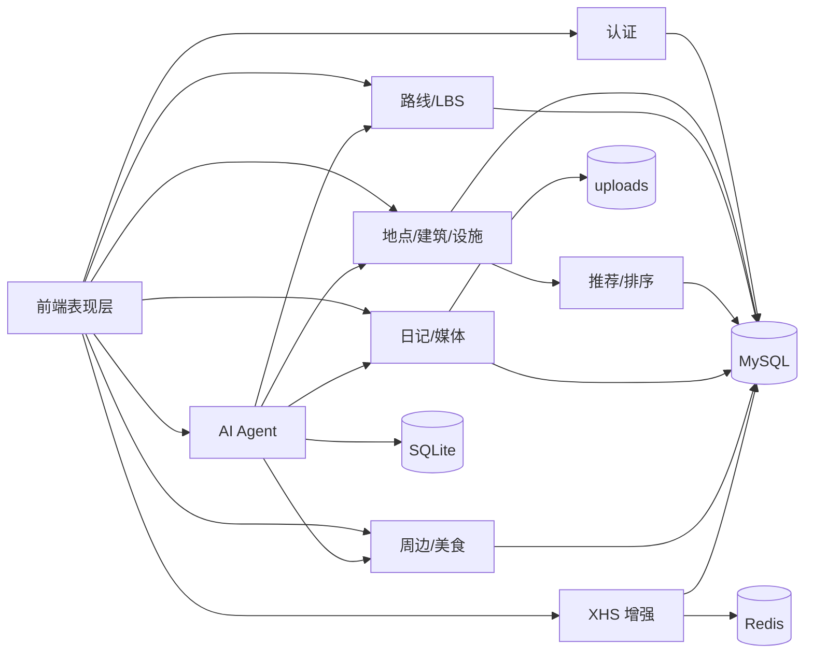

## 7. 物理部署与运行方案

### 7.1 本地运行架构

前端运行于 5173，Java 后端与 Swagger 运行于 8080，Agent 运行于 9000，MySQL 运行于 3306，Redis 运行于 6379。当前三端健康检查均返回 200。

### 7.2 启停方案

`run/start-all.ps1` 先确认或启动 MySQL、Redis，再清理占用端口并启动 Java、前端和 Agent；`run/stop-all.ps1` 停止应用和本地基础设施。配置通过环境变量和本地忽略文件提供，OpenAI Key 已复用，没有明文写入项目；Cookie 和视觉模型配置按需提供。

项目仓库结构、运行脚本和工程文件归档由王博生主责维护；数据库初始化和迁移内容由刘文涛主责校验；Agent 环境和智能体链路由胡文龙主责接入，三人共同完成整体启动与验收准备。

### 7.3 部署拓扑图

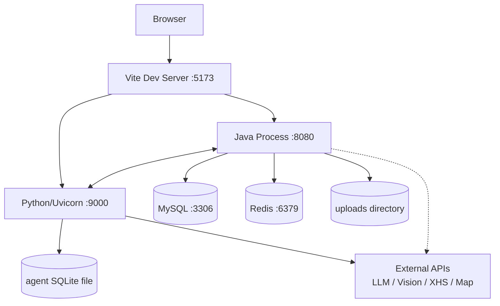

### 7.4 运行验证状态

| 项目 | 结果 |
|---|---|
| 前端生产构建 | 成功 |
| MySQL 数据与 Flyway | 成功 |
| Redis | `PONG` |
| XHS 运行时 | 接通，识别 43 个方法 |
| Java 测试 | 126/132 通过 |
| XHS 定向测试 | 29/33 通过 |
| 前端 lint | 8 个错误、4 个警告 |

系统主要环境可运行，但测试仍有未通过项。

## 8. 数据架构设计

### 8.1 数据分层

- MySQL：用户、地点、路线、内容、周边和 XHS 业务事实；
- Redis：XHS 缓存、TTL 和发布限流；
- SQLite：Agent 会话、消息、搭子、任务与偏好；
- uploads：图片、视频文件和 GIF；
- 外部平台：模型输出、小红书笔记和地图结果，进入系统前需校验或缓存。

### 8.2 MySQL 数据模型总览

| 表 | 用途 | 关键字段 | 模块 | 规模 | 风险 |
|---|---|---|---|---:|---|
| `sys_user` | 用户与画像 | username、password、interests | 认证/推荐 | 约 10 | 密码和 JSON 质量 |
| `spot_place` | 地点主体 | type、rating、lat/lng、images | 地点/路线 | 约 301 | 坐标与覆盖 |
| `spot_building` | 建筑 | place_id、坐标、entrance_node | 详情/室内外 | 约 63 | 入口数据 |
| `spot_facility` | 设施 | place_id、type、坐标 | 设施/LBS | 约 204 | 类型与坐标 |
| `spot_road_edge` | 路网边 | from/to、distance、vehicles | 导航 | 约 483 | 连通和权重 |
| `spot_food` | 美食 | place_id、cuisine、popularity | 美食 | 约 40 | 数据覆盖 |
| `travel_diary` | 日记 | content、author、images、tags、XHS 状态 | 日记 | 约 14 种子 | H2 字段漂移 |
| `user_behavior` | 行为 | user、target、type、score | 推荐/评价 | 动态 | 数据稀疏 |
| `spot_surrounding` | 周边 POI | place_id、type、坐标、价格 | 周边 | 校园约 379，另有批量数据 | 真实性、乱码、重复 |
| `spot_xhs_info` | XHS 热度缓存 | trending、notes、tags、expires | XHS | 动态 | 无稳定种子 |
| `user_xhs_account` | XHS 账号 | user_id、encrypted_cookie、status | XHS | 动态 | Cookie 和权限 |
| `xhs_publish_log` | 发布审计 | diary、user、response、error | XHS | 动态 | 外部失败 |

### 8.3 Redis、SQLite 与文件

Redis 通过键值和 TTL 降低 XHS 重复访问并支撑限流；SQLite WAL 保存 `sessions/messages/user_buddy/tasks/user_preferences`；文件系统保存媒体。Redis 异常不应阻塞地点和日记等基础功能，SQLite 和文件需考虑清理、备份及用户隔离。

### 8.4 迁移与测试数据

基础表来自 `sql/schema.sql`，种子来自 `sql/data.sql`，周边数据使用独立脚本，Flyway V1.1/V2/V3 增加入口节点和 XHS 扩展。H2 测试 Schema 未完全同步 Flyway，已造成日记测试失败和 XHS 聚合覆盖不足。

### 8.5 数据质量方案

数据导入统一 UTF-8；检查重复 ID、空值、异常坐标、同坐标、孤立路网、无效图片和 JSON；区分北邮真实 POI、脚本整理和批量生成数据；外部 XHS 数据保留刷新与过期信息。后续可建立自动质量 SQL 和来源字段。

## 9. 前端总体方案设计

### 9.1 前端职责与组织

前端负责用户交互、路由、页面状态、表单、卡片、地图、日记编辑、SSE 消费、字段归一化、加载/空状态和错误提示。源码按 pages、components、services/api、hooks 和 utils 组织。

### 9.2 页面与路由

当前主入口包括首页、地点搜索/详情、日记列表/详情/我的日记/管理、导航、AI 助手、周边、统计和个人中心。源码中仍有校园导航、室内导航、多点导航、设施等旧页面，但部分未挂载或重定向，验收应以 `App.jsx` 为准。

### 9.3 数据交互

`services/api` 统一 Java REST 调用和字段归一化；`/api/*` 经 Java，部分 `/agent/chat/stream` 直连 FastAPI；SSE 逐步拼接 token，并处理 tool_call、tool_result、done 和 error；媒体路径进行标准化和 fallback。

### 9.4 状态与容错

页面提供加载骨架、空状态、Toast、图片占位和安全返回。降级改善体验，但不能把服务错误静默显示为“真实空数据”，后续应增强错误分类和可观测性。

### 9.5 前端边界

生产构建成功，lint 仍有 8 错误和 4 警告；旧页面不全部属于交付入口；多模态和 XHS 卡片依赖后端与外部数据。

## 10. Java 后端总体方案设计

### 10.1 后端职责

Java 是权威业务服务，负责认证、地点、建筑、设施、路线、推荐、美食、周边、日记、XHS、文件、统计、算法演示、数据库持久化以及部分 Agent 代理。

### 10.2 分层架构

- Controller：HTTP 路由、参数和返回；
- Service/ServiceImpl：业务规则、算法编排和事务；
- Mapper：MyBatis-Plus 数据访问；
- Entity/DTO/VO：持久化、请求和展示模型；
- Config/Security：数据库、Redis、Swagger、CORS、JWT；
- Utils/Exception：统一工具和异常；
- Algorithm：图、推荐、搜索、排序、AC、Huffman、Treap 等。

### 10.3 统一响应与异常

接口使用 `Result<T>` 的 `code/message/data`，由全局异常处理业务异常和系统异常，Swagger 支撑查看。当前测试对部分错误仍期待 HTTP 200，而代码返回 400/401，需统一语义。

### 10.4 安全认证

注册密码经 BCrypt，登录签发 JWT，Filter 解析 Token 并写入 SecurityContext，Principal 向 Agent 代理提供用户身份。当前日记 POST、XHS 白名单和默认密钥等边界需复核。

### 10.5 业务服务

Auth 管身份；Place/Building/Facility 管目的地；Navigation 管室内外图路径；Food/Surrounding 管服务信息；Diary 管内容与文本算法；XHS 管热度、账号和日志；Media 管文件和 GIF；AgentController 代理 Python；AlgorithmController 支撑课程演示。

### 10.6 Java 边界

后端测试 126/132；H2 Schema 漂移；状态码合同差异；权限白名单偏宽；生产 MySQL/Flyway 兼容性不能仅由 H2 证明。

## 11. Python Agent 总体方案设计

### 11.1 设计目标

Agent 提供自然语言助手、意图识别、槽位提取、工具调用、路线辅助、游记生成、出游搭子、SSE、小红书和可选视觉增强。

### 11.2 Agent 架构

FastAPI `main` 暴露接口；Dispatcher 和 Orchestrator 分类路由；Chat/Discover/Route/Diary Agent 处理任务；ToolRegistry 注册工具；`tourism_api` 获取 Java 数据；`model_router` 与 `llm_client` 管模型；SQLite 保存状态；JSONL trace 记录链路。

### 11.3 Agent 调用流程

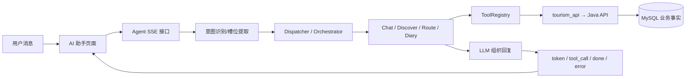

### 11.4 ToolRegistry

工具以 name、description、参数 Schema 和函数注册到哈希映射，按 Agent 作用域隔离并支撑 Function Calling，平均查找 `O(1)`。当前最重要的后续任务是通过契约测试统一 Python 参数与 Java API。

### 11.5 DiaryAgent

流程为文本/图片素材 → 意图和要素 → 风格确认 → 可选视觉理解 → 正文生成 → 润色 → 卡片 → 用户确认 → Java 保存。DeepSeek 等文本模型不承担图片理解，视觉模型和图片访问失败时应回退文本。

### 11.6 Agent 边界

LLM 不确定；工具依赖 Java；Python 直连 `user_id` 可伪造；视觉依赖 URL/base64；XHS 依赖 Cookie；部分 Java 代理端点覆盖不完整；合同仍需加强。

## 12. 接口总体方案设计

### 12.1 REST 原则

Java 接口统一 `/api` 前缀并按业务拆 Controller，使用 `Result<T>`；分页使用 `Page<T>` 或明确的列表结构；参数校验和异常统一处理；Swagger 用于联调。分页字段必须在 Java、前端和 Agent 间统一。

### 12.2 接口模块表

| 模块 | 主要路径 | 方法 | 对象/表 | 登录要求与说明 |
|---|---|---|---|---|
| Auth | `/api/auth/**` | POST/GET | `sys_user` | 登录注册公开，me 受保护 |
| Place | `/api/places/**` | GET/POST | `spot_place` | 浏览为主，可聚合 |
| Building | `/api/buildings/**` | GET | `spot_building` | 查询 |
| Facility | `/api/facilities/**` | GET | `spot_facility` | 查询、附近和最近 |
| Navigation | `/api/navigation/**` | GET/POST | road/indoor | 参数决定路径 |
| Food | `/api/foods/**` | GET | `spot_food` | 列表、热门、地点 |
| Diary | `/api/diaries/**` | CRUD | `travel_diary` | 当前 POST 公开边界需复核 |
| Surrounding | `/api/surroundings/**` | GET/POST | `spot_surrounding` | 查询与评分 |
| XHS | `/api/xhs/**` | GET/POST | XHS 三表、Redis | 外部依赖，权限需加强 |
| Upload | `/api/upload/**` | POST | uploads | 文件校验 |
| Agent | `/api/agent/**`、`/agent/**` | POST/GET/SSE | SQLite+Java | 两种调用路径需统一 |
| Algorithm | `/api/algorithm/**` | GET/POST | 算法输入 | 课程演示 |

### 12.3 SSE 方案

SSE 发送 `token`、`tool_call`、`tool_result`、`done` 和 `error`，前端增量展示并在 done 解析卡片与图片。断连或工具失败时保留有限结果并明确错误，不伪造完成。

### 12.4 Java—Agent 接口

Java 提供业务数据，Python 经 `tourism_api` 调用；Java AgentController 代理部分 Agent 能力。当前存在搜索参数、热门数量、美食分页、路线起终点、多点路线和最近设施等合同风险，应通过 OpenAPI 和自动契约测试锁定。

### 12.5 安全与错误

接口需处理 JWT、参数错误、未授权、资源不存在、数据为空、模型超时、平台失败和 Redis 异常。前端应区分真实空状态与服务错误。

## 13. 核心业务流程设计

### 13.1 用户登录认证流程

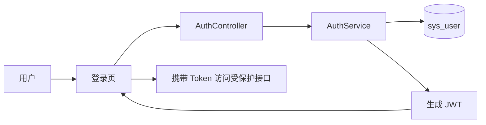

密码使用 BCrypt 校验，JWT Filter 恢复用户上下文。涉及认证模块和 `sys_user`。边界是状态码合同、接口白名单和默认密钥仍需统一。

### 13.2 地点浏览与详情流程

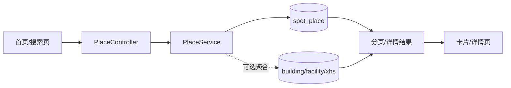

分页、条件构造器和排序满足快速查找；XHS 聚合失败不应阻塞基础地点。数据未覆盖的地点返回空结果。

### 13.3 推荐排序流程

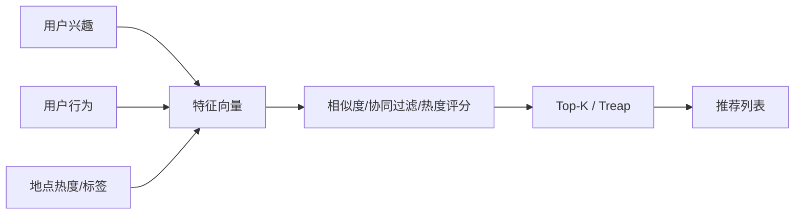

涉及 `sys_user`、`user_behavior`、`spot_place` 和日记数据。候选少时直接排序，候选扩大时 Top-K 减少排序压力。行为与标签质量决定效果。

### 13.4 附近设施与周边流程

涉及设施和周边表，扫描候选为 `O(n)`、排序为 `O(n log n)`。若计算路网可达距离则使用 Dijkstra；直线距离不等于实际道路距离。

### 13.5 路线规划流程

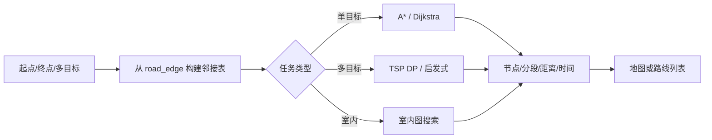

数据不足、节点不连通或坐标异常时返回不可达。多点启发式不保证全局最优。

### 13.6 日记管理流程

日记使用分页、媒体 JSON、评分和用户行为。H2 缺少新增字段是测试边界，不代表 MySQL 主库环境缺失。

### 13.7 AI 写游记流程

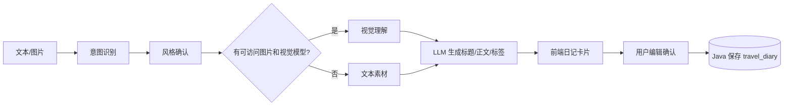

AI 只生成草稿；视觉失败可回退文本；用户确认是保存前置条件。

### 13.8 小红书热门数据流程

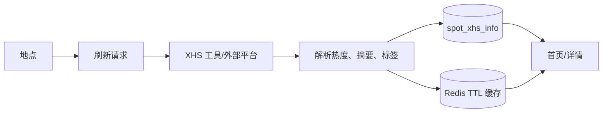

流程依赖 Cookie、平台接口和账号状态；失败时使用已有缓存、普通热门地点或空状态。

### 13.9 AI 旅游助手流程

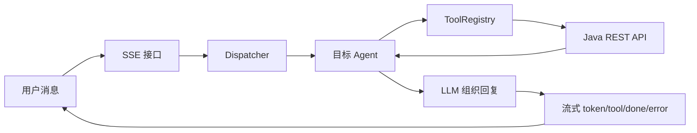

Agent 用于意图识别、路线辅助、工具调用和游记生成。核心地点、路线和美食事实来自 Java；工具失败时返回降级提示。

## 14. 算法总体方案与性能分析

| 算法 / 结构 | 架构层 | 功能 | 输入 → 输出 | 选择理由 | 复杂度 / 性能 | 状态与优化 |
|---|---|---|---|---|---|---|
| 图/邻接表 | Java 算法层 | 路线 | road 边 → 稀疏图 | 适合稀疏路网 | 空间 `O(V+E)` | 核心；需提升覆盖 |
| Dijkstra | Java 算法层 | 最短路/最近设施 | 非负图 → 路径 | 稳定、可解释 | `O((V+E)logV)` | 核心；可做多源优化 |
| A* | Java 算法层 | 单目标路线 | 起终点 → 路径 | 目标明确时少扩展节点 | 最坏近 Dijkstra | 核心；启发依赖坐标 |
| TSP | Java 算法层 | 多点游览 | 目标集 → 顺序 | 小规模可精确、较大可近似 | DP `O(n²2ⁿ)` | 增强；不保证大规模全局最优 |
| Haversine | Java/LBS | 附近/启发 | 经纬度 → 距离 | 简单、无需路网 | 单次 `O(1)`，扫描 `O(n)` | 已用；大规模加空间索引 |
| Top-K/Treap | 推荐层 | 热门/推荐 | 分数流 → 前 K | 避免全量排序 | 平均 `O(n log k)` | 课程核心 |
| TF-IDF/Jaccard/模糊 | 搜索推荐 | 文本相似 | 查询文本 → 排序 | 适合课程规模 | TF-IDF 约 `O(ND)` | 限定场景，可引入倒排索引 |
| 余弦/协同过滤 | 推荐层 | 个性化 | 特征/行为 → 候选 | 融合内容和行为 | 单候选余弦 `O(D)` | 课程级，数据稀疏 |
| AC 自动机 | 日记层 | 敏感词 | 词集+正文 → 命中 | 一次扫描多模式 | `O(L+z)` | 已接入 |
| Huffman | 日记层 | 文本封装 | 正文 ↔ 编码 | 展示前缀压缩 | 构树 `O(σlogσ)` | 课程级，不是通用压缩平台 |
| JSON 字段 | 数据层 | 兴趣/标签/媒体 | 对象 ↔ JSON | 灵活扩展 | 解析随长度线性 | 需 Schema 校验 |
| `Page<T>` | 数据访问层 | 列表 | page/size → records | 控制查询和传输 | 依索引与 SQL | 广泛使用 |
| MyBatis Wrapper | 数据访问层 | 动态筛选 | 条件 → SQL | 减少模板代码 | 依执行计划 | 需索引优化 |
| JWT | 安全层 | 用户上下文 | 凭据 → Token | 无状态 | 与 Token 长度近线性 | 核心；密钥需加固 |
| ToolRegistry | Agent 层 | 工具调度 | name/args → result | 动态注册与隔离 | 查找平均 `O(1)` | 核心；需契约测试 |
| SSE | 交互层 | 流式回复 | 事件 → UI | 降低首字等待 | 与事件量线性 | 已接入 |
| Redis | 缓存层 | XHS/限流 | key → value | 减少外部访问 | 命中近 `O(1)` | 增强；需熔断 |
| Fibonacci Heap | 演示层 | 堆算法 | 键值 → 堆操作 | 展示摊还性能 | 插入摊还 `O(1)` 等 | 有实现测试，非路线主堆 |

### 14.1 算法选择对比

- **Dijkstra 与 A\*：** Dijkstra 不依赖启发并稳定求非负权最短路；A* 利用 Haversine 指向目标，通常扩展更少，但坐标和启发质量会影响效果。
- **TSP 精确与启发式：** DP 可在少量目标下获得精确结果，但指数增长；最近邻、模拟退火和遗传策略适合更多目标，但只提供近似解。
- **全量排序与 Top-K：** 全量排序简单，适合当前小数据；只需要前 K 时，Treap/堆可降低候选扩大后的成本。
- **关键词与 TF-IDF：** LIKE 适合直接字段查找；TF-IDF/相似度能体现文本相关性，但需要分词和文档统计。
- **逐词匹配与 AC：** 对每个敏感词逐一扫描成本高；AC 通过 Trie 和 fail 指针一次扫描文本。
- **普通文本与 Huffman：** 普通文本易维护；Huffman 展示压缩思想，但会增加编码元数据和业务复杂度。
- **规则助手与 LLM+ToolRegistry：** 规则确定、成本低但表达覆盖有限；LLM 更灵活，需工具提供事实并通过规则和降级控制不确定性。

### 14.2 性能小结

当前课程数据规模下，分页、索引、缓存、Top-K 和图搜索能够满足演示。扩大规模后应增加空间/GIS 索引、倒排索引、异步任务、缓存策略、图预处理、批量接口、契约测试和 CI。外部模型与平台性能受网络、配额和服务状态影响。

## 15. AI / 智能体辅助总体方案设计

### 15.1 AI 辅助架构设计

AI 协助梳理三服务架构、区分 Java 确定性业务和 Python 智能编排、分析 MySQL/Redis/SQLite 分工并提出降级边界；最终由源码、配置和运行结果核验。

### 15.2 AI 辅助模块设计

AI 辅助整理地点、路线、日记、周边、XHS 和 Agent 的职责、接口和流程，人工根据 Controller、Service、前端路由和 Agent 实现修正。

### 15.3 AI 辅助算法设计

AI 辅助比较 Dijkstra、A*、TSP、Top-K、TF-IDF、协同过滤、AC 和 Huffman，并识别 Fibonacci Heap 为演示扩展。复杂度和接入状态由源码与测试确认。

### 15.4 AI 辅助测试与定位

AI 协助定位路线工具合同、周边乱码、图片重复、XHS 解析、日记图片和 H2 Schema 问题，并整理 Fix Plan/Root Cause；最终测试数字来自实跑。

### 15.5 AI 辅助文档

AI 用于生成事实底稿、报告结构、表格和算法说明；人工删除夸大表述、确认状态、数字和边界。

### 15.6 AI 辅助设计说明表

| 环节 | AI 辅助 | 人工核验 | 结果 |
|---|---|---|---|
| 架构 | 三服务与存储分工 | 源码、配置、端口 | 总体架构 |
| 模块 | 职责、调用和数据流 | 路由、Controller、Agent | 模块关系 |
| 算法 | 选择和复杂度比较 | 算法类与测试 | 性能方案 |
| 开发 | 接口、页面、SQL、工具建议 | 编译、构建、运行 | 工程实现 |
| 测试 | 用例和失败分类 | 实跑命令 | 真实验证结果 |
| 文档 | 初稿与一致性检查 | 人工审阅 | 最终报告 |

### 15.7 成员在总体方案设计中的贡献

王博生主要从前后端工程、接口适配、页面交互、仓库和运行组织角度校准总体方案；刘文涛主要从数据库、数据字典、算法实现、复杂度和课程报告角度完成论证；胡文龙主要从 Agent 编排、工具调用、SSE、SQLite、AI 功能和前端美化角度校准智能体方案。总体架构和边界由三位成员结合联调、测试与验收要求共同确认。

## 16. 安全、容错与降级设计

### 16.1 安全设计

系统采用 BCrypt、JWT、Spring Security、Filter 和 Principal；XHS Cookie 应加密；Key 通过环境变量管理，OpenAI Key 未明文写入项目。当前默认配置、XHS 属性路径、接口白名单和服务间鉴权仍需加强。

### 16.2 容错设计

空数据展示 EmptyState；缺图使用 fallback；Redis/XHS 失败不阻塞基础地点；视觉不可用时回退文本；路线不可达时提示；Agent 工具失败返回有限回复或错误；缓存数据需标记时效。

### 16.3 观测与调试

Swagger、Java/Python/前端日志、Agent JSONL trace、任务状态、健康检查和测试报告共同支撑定位。后续需结构化日志、请求 ID、指标、告警和更完整契约测试。

### 16.4 已知边界

日记 POST 和 XHS 公开范围需复核；Python 直连 `user_id` 有伪造风险；Agent—Java 参数不一致；前端 `safe`/fallback 可能掩盖错误；H2 与 MySQL 漂移。

## 17. 测试与运行验证方案

### 17.1 验证目标

验证系统能启动、三端可访问、数据库和迁移可用、Redis 正常、核心接口和算法可测、XHS 运行时接通，并使遗留问题可定位。

### 17.2 当前结果

| 验证 | 结果 | 结论 |
|---|---|---|
| 三端健康检查 | 全部 HTTP 200 | 核心服务可访问 |
| 前端构建 | 成功 | 生产构建环境完整 |
| MySQL/Flyway | 成功 | 主库和迁移可用 |
| Redis | `PONG` | 缓存服务可用 |
| XHS 运行时 | 43 个方法 | 依赖已接通，不代表平台稳定 |
| Java 测试 | 126/132 | 状态码和 H2 Schema 等 6 项失败 |
| XHS 测试 | 29/33 | 解析/旧 Mock 合同 4 项失败 |
| 前端 lint | 8 错误、4 警告 | 代码规范遗留 |

剩余失败属于代码、测试 Schema 或旧契约问题，并非环境缺失。

### 17.3 测试覆盖

采用 Java 算法单测和集成测试、Agent pytest、前端 build/lint、Swagger 手工接口、页面演示、数据库查询、健康检查和运行截图。后续增加 Python→Java 契约测试和端到端 UI 测试。

### 17.4 测试边界

不能写全部通过；应修复 H2 Schema、权限和状态码期望、XHS 测试、前端 lint，并在完整虚拟环境中持续复跑。

## 18. 运行效果与截图规划

| 序号 | 建议截图 | 说明 |
|---:|---|---|
| 1 | 前端首页 | 此处后续插入运行截图 |
| 2 | 地点搜索页 | 此处后续插入运行截图 |
| 3 | 地点详情页 | 此处后续插入运行截图 |
| 4 | 导航 / 路线规划 | 此处后续插入运行截图 |
| 5 | 周边页面 | 此处后续插入运行截图 |
| 6 | 日记列表 / 详情 | 此处后续插入运行截图 |
| 7 | AI 助手对话 | 此处后续插入运行截图 |
| 8 | AI 写游记结果 | 此处后续插入运行截图 |
| 9 | XHS 热门卡片 | 此处后续插入；需标明数据状态 |
| 10 | Swagger | 此处后续插入运行截图 |
| 11 | 后端 / Agent 健康检查 | 此处后续插入运行截图 |
| 12 | 测试或启动脚本 | 此处后续插入真实结果截图 |

## 19. 创新性与价值分析

### 19.1 系统创新性

系统将校园、景区和城市旅游数据统一，组合地点、路线、周边、日记和 AI 助手，引入 ToolRegistry 工具调用、AI 写游记、出游搭子、XHS 热度增强及多类课程算法。

### 19.2 用户价值

用户可更快发现地点、安排路线、查询周边、记录旅行，以自然语言使用系统，并借助 AI 降低内容创作成本；外部热度可作为补充参考。

### 19.3 课程设计价值

项目覆盖图和路径搜索、推荐和 Top-K、文本匹配和压缩、分页和 JSON、缓存、工具哈希映射、SSE 数据流及多服务工程化。

### 19.4 创新边界

XHS 依赖平台，多模态依赖视觉模型，搭子和部分创新为增强或演示能力，不能定义为无条件稳定的生产产品。

## 20. 风险、边界与后续优化

| 风险 | 当前事实 | 影响 | 后续优化 | 口径 |
|---|---|---|---|---|
| 数据覆盖 | 地点/服务有限 | 搜索、推荐空 | 扩充和质量标记 | 依赖数据 |
| 路网坐标 | 覆盖与坐标不均 | 不可达、距离失真 | 连通检查、GIS | 不保证任意城市 |
| Agent—Java 合同 | 参数/字段有错位 | 工具空或失败 | OpenAPI、契约测试 | 框架已实现，合同待加强 |
| XHS | Cookie、反爬、平台变化 | 刷新/发布失败 | 健康检查、缓存、降级 | 外部依赖 |
| 多模态 | Key、网络、图片 URL | 图片理解失败 | URL/base64、模型路由 | 可选增强 |
| Redis | XHS 增强依赖 | 缓存/限流异常 | 熔断、回退 | 非全部核心必需 |
| 密钥 | 默认配置风险 | 安全问题 | 环境变量和轮换 | 安全体系仍需完善 |
| 权限 | 白名单和直连身份偏弱 | 越权 | 收紧接口、服务鉴权 | 边界需完善 |
| H2/MySQL | Schema 漂移 | 假失败/假通过 | Testcontainers/同步迁移 | 当前有 6 项失败 |
| 前端降级 | 可能掩盖后端错误 | 可观测性弱 | 错误分类和告警 | 降级不等于真实数据 |
| 页面遗留 | 未挂载页面存在 | 文档夸大 | 清理或标记 | 以 App 路由为准 |
| 文档过期 | README/周报有旧事实 | 验收冲突 | 事实底稿统一 | 源码实跑优先 |
| 图片重复 | 历史重复未全量验证 | 展示质量 | MD5/引用去重 | 未彻底消除 |
| 周边乱码 | 历史导入编码问题 | 内容不可读 | UTF-8 重导、抽检 | 数据分层 |
| GIF 命名 | “视频”实为 GIF | 能力误解 | 重命名 | GIF 动画合成 |
| lint/测试 | 非全绿 | 质量扣分 | 修复并 CI | 如实记录 |

## 21. 与其他专项报告及课程设计主报告的关系

1. **软件开发任务描述报告：** 本报告把开发任务转化为架构、组件和数据流；任务报告说明实施过程和交付。
2. **功能需求与分析报告：** 需求定义“做什么”，总体方案定义“整体如何实现”，两者共用状态和边界。
3. **数据结构和数据字典报告：** 本报告的数据架构和算法表为字段、索引和结构细化提供入口。
4. **各模块设计报告：** 逻辑模块、接口和流程将继续展开到类、方法、时序和异常。
5. **应用范例及测试报告：** 运行拓扑、流程和验证表提供测试对象、环境和预期。
6. **评价和改进报告：** 风险表和技术边界直接形成优缺点评价和优化路线。
7. **用户使用说明：** 部署、入口和业务流程可转化为安装、操作和常见问题步骤。
8. **课程设计主报告：** 可提取架构图、创新点、算法、运行结果和边界形成总体摘要。

## 22. 总结

本系统采用 React 前端、Spring Boot Java 后端、Python FastAPI Agent、MySQL、Redis、SQLite 的三服务总体架构。Java 承担确定性业务、算法和数据持久化，Python Agent 承担智能编排、LLM 与工具调用，前端承担用户交互和结果展示。

系统通过图与邻接表、Dijkstra、A*、TSP、Haversine、Top-K/Treap、TF-IDF、AC 自动机、Huffman、分页、Redis 和 ToolRegistry 体现数据结构课程设计特点。大模型和智能体在架构梳理、模块拆分、算法分析、开发测试和文档生成中发挥辅助作用，最终事实由人工依据源码、SQL 和实跑结果确认。

当前主要环境已启动，三端健康检查通过，前端构建、MySQL/Flyway 和 Redis 验证成功；仍存在测试契约、lint、H2 Schema、数据质量、外部平台、多模态配置、跨服务合同和权限边界等问题。本报告为后续数据结构说明、模块设计、测试、评价改进和用户手册提供总体设计依据。

## 最终交付内容

本报告最终交付报告正文、核心表格、架构与流程图、AI/智能体辅助说明、成员分工与贡献说明、风险边界、与其他专项报告及课程设计主报告的关系，以及可供 `report.docx` 提炼的关键素材。特有交付项包括总体架构图、部署拓扑图、模块关系图、核心业务流程图、技术选型表、数据架构表、接口模块表及算法与性能分析表。
