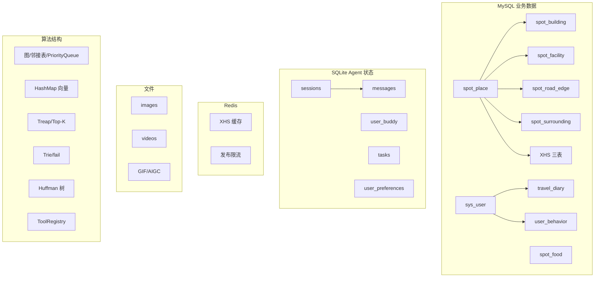
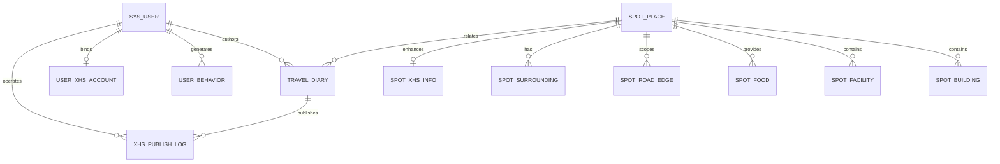

# 智能旅游系统数据结构和数据字典报告

> 用途：数据结构课程设计最终提交  
> 日期：2026 年 6 月 20 日  
> 组长：刘文涛  
> 事实依据：当前 SQL、Flyway、Java Entity/DTO/VO、Agent SQLite Schema、算法源码与最新实跑结果

## 1. 引言

### 1.1 编写目的

本报告说明智能旅游系统的数据库结构、业务实体、表间关系、字段字典、索引、JSON、缓存、文件资源、Agent 本地存储、接口数据结构和算法数据结构，为模块设计、测试、运行、评价和课程验收提供数据层依据。

### 1.2 项目数据背景

系统围绕用户、地点、建筑、设施、道路、美食、日记、行为、周边、小红书、Agent 会话和媒体资源组织数据。MySQL 保存业务主数据，Redis 支撑小红书缓存和限流，SQLite 保存 Agent 会话与任务，`uploads` 保存图片、视频文件和 GIF。

### 1.3 报告范围与依据

报告覆盖 MySQL、Entity/DTO/VO、关系和索引、JSON、SQLite、Redis、文件、前后端传输、Agent 工具和算法内存结构。依据包括 `sql/schema.sql`、Flyway V1.1/V2/V3、Entity、Mapper/Service、算法类、`sqlite_store.py`、ToolRegistry、前端 API、测试 Schema 和统一事实底稿。

### 1.4 最新验证基线

截至 2026 年 6 月 20 日，前端、后端和 Agent 健康检查均返回 200；MySQL 数据及 Flyway 迁移成功；Redis 返回 `PONG`；前端生产构建成功；XHS 运行时识别 43 个方法；Java 测试 126/132 通过，XHS 测试 29/33 通过；前端 lint 仍有 8 个错误、4 个警告。剩余失败属于代码、测试 Schema 或旧接口契约问题，并非环境缺失。OpenAI Key 通过环境变量复用，没有明文写入项目。

## 2. 数据结构设计总览

### 2.1 数据分层

1. MySQL 主业务数据；
2. Redis 缓存与限流数据；
3. SQLite Agent 本地状态；
4. uploads 文件资源；
5. DTO/VO 与前端传输结构；
6. Agent 消息、工具 Schema 和 SSE 事件；
7. 图、树、队列、哈希映射等算法内存结构。

### 2.2 数据结构分层图

### 2.3 设计原则

业务数据结构化、高频字段索引化、可变列表 JSON 化、路网图结构化、Agent 状态轻量持久化、缓存与权威数据分离、算法服务业务、测试与生产结构同步、数据来源和质量可追踪。

## 3. MySQL 数据库总体设计

### 3.1 主表总览

| 表 | 用途 | 关键字段 | 模块 / 结构 | 规模口径 | 状态与风险 |
|---|---|---|---|---:|---|
| `sys_user` | 用户与画像 | username、password、interests | 认证、JWT、推荐 | 约 10 | 核心；密码需密文 |
| `spot_place` | 地点主体 | type、rating、lat/lng、JSON 标签 | 搜索、详情、路线 | 约 301 | 坐标/图片质量 |
| `spot_building` | 建筑 | place_id、lat/lng、entrance_node_id | 详情、室内外导航 | 约 63 | 入口由迁移增加 |
| `spot_facility` | 设施 | place_id、type、lat/lng | 设施、LBS | 约 204 | 坐标有效性 |
| `spot_road_edge` | 道路边 | from/to、distance、vehicles | 图、Dijkstra/A* | 约 483 | 连通性决定路线 |
| `spot_food` | 美食 | place_id、cuisine、popularity | 查询、排序 | 约 40 | 覆盖有限 |
| `travel_diary` | 日记 | content、author、media、XHS 字段 | CRUD、AC/Huffman | 约 14 | H2 缺迁移字段 |
| `user_behavior` | 行为 | user、target、type、score | 推荐/协同过滤 | 动态 | 种子稀少 |
| `spot_surrounding` | 周边 POI | place、type、坐标、价格、标签 | 周边/Haversine | 379 脚本 + 约 4000 批量脚本 | 不等于全部真实导入 |
| `spot_xhs_info` | XHS 热度 | place、score、notes、expires | 缓存增强 | 无稳定种子 | 外部刷新 |
| `user_xhs_account` | XHS 账号 | user、encrypted_cookies、status | 绑定 | 无稳定种子 | Cookie/权限 |
| `xhs_publish_log` | 发布审计 | user、diary、response、error | 审计 | 运行时 | 外部失败 |

### 3.2 E-R 关系图

多数关系通过 `place_id`、`user_id`、`diary_id` 等逻辑字段维护，基础 SQL 未对所有关系声明物理外键，应用层必须保证引用一致性。

### 3.3 数据库边界

SQL INSERT 数不等于当前库行数；迁移会扩展基础表；H2 与 MySQL 有结构差异；XHS 无稳定种子；周边数据来源和编码质量不同；图片路径不保证文件存在；行为数据不足会限制推荐效果。

## 4. 核心数据字典

### 4.1 `sys_user` 用户表

用途：注册、登录、用户画像和 JWT 上下文。主键 `id`，`username` 唯一，与日记、行为和 XHS 账号逻辑关联。

| 字段 | 类型 | 必填/默认 | 约束 | 业务含义 |
|---|---|---|---|---|
| id | BIGINT | 必填/自增 | PK | 用户 ID |
| username | VARCHAR(50) | 必填 | UNIQUE | 登录名 |
| password | VARCHAR(255) | 必填 |  | BCrypt 密文 |
| interests | JSON | 可空 |  | 兴趣标签数组 |
| favorite_categories | JSON | 可空 |  | 偏好类别数组 |
| avatar | VARCHAR(500) | 可空 |  | 头像 URL |
| deleted | TINYINT(1) | 0 | 逻辑删除 | 删除标志 |
| created_at / updated_at | DATETIME | 自动 |  | 审计时间 |

质量边界：不得存明文密码；JSON 需合法；种子约 10 条。

### 4.2 `spot_place` 地点表

承担地点浏览、搜索、推荐、详情、路线和周边入口。

| 字段组 | SQL 类型 | 约束/索引 | 含义 |
|---|---|---|---|
| id | VARCHAR(32) | PK | 地点业务 ID |
| name / type | VARCHAR(100/20) | 必填；type 索引 | 名称和类型 |
| keywords / features | JSON | 可空 | 关键词和特色标签 |
| rating / rating_count | DECIMAL / INT | rating 索引 | 评分聚合 |
| click_count | INT | 索引，默认 0 | 热度 |
| lat / lng | DECIMAL(10,7) | 可空 | WGS84 坐标 |
| address / open_time | VARCHAR | 可空 | 地址和开放时间 |
| image | VARCHAR(500) | 可空 | 封面路径 |
| description / detail_description | TEXT | 可空 | 简介和详情 |
| deleted / created_at / updated_at | 标志/时间 | 默认值 | 生命周期 |

约 301 条。坐标影响 LBS/A*，图片可能缺失或重复；Entity 另有 map 坐标和 `xhsInfo` 等非基础表展示字段。

### 4.3 `spot_building` 建筑表

| 字段 | 类型 | 约束 | 含义 |
|---|---|---|---|
| id | VARCHAR(50) | PK | 建筑 ID |
| name / type | VARCHAR | name 必填 | 建筑名称和分类 |
| place_id | VARCHAR(32) | 索引、必填 | 所属地点 |
| lat / lng | DECIMAL(11,7) | 可空 | 坐标 |
| description / rating | VARCHAR/DECIMAL | 可空 | 描述和评分 |
| entrance_node_id | VARCHAR(64) | Flyway V1.1 | 室外路网入口节点 |
| deleted / timestamps | 标志/时间 | 默认 | 生命周期 |

约 63 条，支撑详情聚合和室内外导航。入口字段来自迁移，不在基础建表段中。

### 4.4 `spot_facility` 设施表

| 字段 | 类型 | 约束 | 含义 |
|---|---|---|---|
| id | VARCHAR(50) | PK | 设施 ID |
| name / type | VARCHAR | 必填；type 索引 | 名称和类型 |
| place_id | VARCHAR(32) | 索引 | 所属地点 |
| lat / lng | DECIMAL(11,7) | 可空 | Haversine 输入 |
| description / rating | VARCHAR/DECIMAL | 可空 | 展示属性 |
| deleted / timestamps | 标志/时间 | 默认 | 生命周期 |

约 204 条。Entity 的 `distance`、`travelTime`、map 坐标为查询计算/展示字段，不一定对应基础表列。

### 4.5 `spot_road_edge` 道路边表

| 字段 | 类型 | 约束/索引 | 含义 |
|---|---|---|---|
| id | VARCHAR(80) | PK | 边 ID |
| from_node / to_node | VARCHAR(80) | 分别索引、必填 | 起终节点 |
| distance | DECIMAL(10,2) | 必填、非负 | 距离边权 |
| ideal_speed | DECIMAL(5,1) | 默认 4.0 | 理想速度 |
| congestion_rate | DECIMAL(3,2) | 默认 1.0 | 拥堵系数 |
| allowed_vehicles | JSON | 可空 | 允许交通方式 |
| road_type / place_id | VARCHAR | place 索引 | 道路类型和范围 |
| deleted / created_at | 标志/时间 | 默认 | 生命周期 |

约 483 条。边表便于持久化，加载后转为 `Map<Node, Map<Neighbor,RoadInfo>>` 邻接表，空间 `O(V+E)`。距离、速度和拥堵决定权重；缺边或断图会导致不可达。

### 4.6 `spot_food` 美食表

| 字段 | 类型 | 约束 | 含义 |
|---|---|---|---|
| id / name | VARCHAR | PK / 必填 | 美食标识和名称 |
| place_id | VARCHAR(32) | 索引 | 所属地点 |
| cuisine | VARCHAR(30) | 索引 | 菜系 |
| popularity | INT | 默认 0 | 人气排序 |
| description / price / location | VARCHAR | 可空 | 描述、价格、位置 |
| deleted / timestamps | 标志/时间 | 默认 | 生命周期 |

约 40 条。Entity 还包含 building/shop/restaurant/window/rating 等扩展字段，需以实际迁移或查询映射为准，反映基础 SQL 与模型演进存在差异。

### 4.7 `travel_diary` 旅行日记表

| 字段组 | 类型 | 约束/索引 | 含义 |
|---|---|---|---|
| id / title / content | VARCHAR/LONGTEXT | PK；title 必填 | 日记标识与正文 |
| place_id / author_id | VARCHAR/BIGINT | 分别索引；作者必填 | 地点与作者 |
| click_count / like_count | INT | 默认 0 | 热度 |
| rating / rating_count | DECIMAL/INT | 默认 | 评分 |
| images / videos / tags | JSON | 可空 | 媒体与标签 |
| xhs_publish_status | VARCHAR(20) | V3 可空 | 发布状态 |
| xhs_note_id / xhs_publish_url | VARCHAR | V3 可空 | 外部结果 |
| xhs_published_at | DATETIME | V3 可空 | 发布时间 |
| deleted / timestamps | 标志/时间 | author/place/time 索引 | 生命周期 |

约 14 条种子。AC 自动机用于敏感词过滤，Huffman 用于课程级正文封装。H2 缺 V3 字段导致部分测试失败。

### 4.8 `user_behavior` 用户行为表

| 字段 | 类型 | 约束 | 含义 |
|---|---|---|---|
| id | BIGINT | PK 自增 | 行为 ID |
| user_id | BIGINT | 索引 | 用户 |
| target_id | VARCHAR(32) | 索引 | 地点或日记 |
| behavior_type | VARCHAR(20) | 索引 | VIEW/LIKE/RATE/COLLECT |
| score | DECIMAL(3,1) | 默认 1.0 | 评分/权重 |
| created_at | DATETIME | 默认 | 时间 |

`(user_id,target_id,behavior_type)` 唯一，防重复行为。主 SQL 缺大量种子，协同过滤依赖运行积累。

### 4.9 `spot_surrounding` 周边表

| 字段组 | 类型 | 约束/索引 | 含义 |
|---|---|---|---|
| id / name / type / sub_type | VARCHAR | PK；type/sub_type 索引 | POI 标识与分类 |
| place_id | VARCHAR(32) | 索引、必填 | 所属地点 |
| lat / lng | DECIMAL(10,7) | 必填 | 坐标 |
| address / phone / open_time | VARCHAR | 可空 | 联系与营业信息 |
| distance_meters | INT | 组合索引 | 预计算距离 |
| price_range / avg_cost | VARCHAR/DECIMAL | 可空 | 价格 |
| image / images / tags | VARCHAR/TEXT | 可空 | 封面、多图和标签 JSON 文本 |
| rating / rating_count / click_count | 数值 | rating/click 索引 | 排序指标 |
| description / detail_description | 文本 | 可空 | 描述 |
| student_discount / must_try | 标志/文本 | 默认/可空 | 学生优惠和推荐 |
| deleted / timestamps | 标志/时间 | 默认 | 生命周期 |

类型包括 restaurant、shopping、entertainment、hotel、transport、service。校园脚本约 379、批量景区脚本约 4000，但不能简单视为全部已导入且真实。Haversine 可动态计算距离；需治理乱码、模板和来源。

### 4.10 `spot_xhs_info` 热度表

| 字段 | 类型 | 约束 | 含义 |
|---|---|---|---|
| id | BIGINT | PK 自增 | 记录 ID |
| place_id | VARCHAR(32) | UNIQUE/索引 | 地点 |
| place_name | VARCHAR(128) | 可空 | 名称快照 |
| trending_score / note_count | INT | 默认 0 | 热度与笔记数 |
| top_notes | MEDIUMTEXT | 可空 | 笔记摘要 JSON/文本 |
| top_tags / top_keywords / search_queries | TEXT | 可空 | 标签关键词和查询 |
| cache_expires | DATETIME | 可空 | 过期时间 |
| last_updated / timestamps | DATETIME | 默认 | 刷新与审计时间 |

无稳定种子，依赖 XHS 刷新并可与 Redis 配合。

### 4.11 `user_xhs_account` 账号表

| 字段 | 类型 | 约束 | 含义 |
|---|---|---|---|
| id / user_id | BIGINT | PK；user 唯一/索引 | 绑定关系 |
| encrypted_cookies | TEXT | 必填 | 加密 Cookie |
| xhs_user_id / xhs_username / xhs_avatar | VARCHAR | 可空 | 平台身份 |
| status | TINYINT | 默认 1 | 账号状态 |
| last_validated_at / timestamps | DATETIME | 可空/默认 | 验证和审计 |

Cookie 必须加密；账号有效性受平台影响。

### 4.12 `xhs_publish_log` 发布日志表

| 字段 | 类型 | 约束/索引 | 含义 |
|---|---|---|---|
| id | BIGINT | PK | 日志 ID |
| user_id / diary_id | BIGINT/VARCHAR | user+time、diary 索引 | 操作主体和日记 |
| action | VARCHAR(20) | 必填 | 操作类型 |
| request_summary / response_data | TEXT | 可空 | 请求摘要与响应 |
| error_msg / ip_address | VARCHAR | 可空 | 错误与来源 IP |
| created_at | DATETIME | 默认 | 时间 |

运行时产生，用于成功、失败和异常审计，不证明外部发布稳定。

## 5. Entity、DTO、VO 与前端数据结构

### 5.1 Java Entity 总览

| Entity | 表 | 主要字段/特殊结构 | 模块与说明 |
|---|---|---|---|
| SysUser | sys_user | interests、favoriteCategories 为 JSON 字符串 | 认证与推荐 |
| SpotPlace | spot_place | keywords/features；map 坐标和 xhsInfo 为扩展展示 | 地点 |
| SpotBuilding | spot_building | placeId、坐标、entranceNodeId | 建筑/导航 |
| SpotFacility | spot_facility | distance、travelTime 等计算字段 | 设施/LBS |
| SpotFood | spot_food | 基础字段及部分演进扩展字段 | 美食 |
| SpotRoadEdge | spot_road_edge | from/to、distance、allowedVehicles | 图边 |
| TravelDiary | travel_diary | media JSON、XHS V3 字段 | 日记 |
| UserBehavior | user_behavior | targetId、behaviorType、score | 推荐 |
| SpotSurrounding | spot_surrounding | 多图/标签文本、价格和优惠 | 周边 |
| SpotXhsInfo | spot_xhs_info | notes/tags/keywords/过期时间 | XHS 热度 |
| UserXhsAccount | user_xhs_account | encryptedCookies、status | XHS 账号 |
| XhsPublishLog | xhs_publish_log | request/response/error | 发布审计 |

Entity 字段多使用驼峰命名映射下划线列。部分 Entity 包含 `@TableField(exist=false)` 或模型演进字段，不能仅凭类字段认定数据库基础 schema 一定存在对应列。

### 5.2 DTO / VO

| 结构 | 用途 | 主要字段 |
|---|---|---|
| LoginDTO / RegisterDTO | 认证请求 | username、password、interests、favoriteCategories |
| LoginVO | 登录返回 | token、用户信息 |
| UserProfileVO | 用户展示 | id、username、avatar、解析后的兴趣列表 |
| PlaceDetailVO | 聚合详情 | place、buildings、facilities 等 |
| MultiPointRouteRequest | 多点路线请求 | start/end、坐标、waypoints、mode、algorithm、vehicle、strategy、provider |
| AgentChatRequest | Java Agent 请求 | message、session 等 |
| `Result<T>` | 统一响应 | code、message、data |
| `Page<T>` | 分页 | records、total、size、current/pages |

DTO 接收请求，VO 隔离返回结构。当前 Python 工具与 Java 在部分参数和分页字段上仍有合同差异，需要自动契约测试。

### 5.3 前端数据模型

前端 `services/api` 将 `Result<T>` 解包并对地点、日记、周边和 Agent 消息做字段归一化；图片路径进行 URL 拼接和 fallback；列表维护加载、空状态和分页；SSE 消息包含文本片段、工具事件和卡片 metadata。旧页面未挂载时不属于正式数据入口。

## 6. SQLite Agent 本地数据字典

SQLite 是 Agent 本地状态库，不是业务主数据库。连接启用 WAL、外键，并以线程锁保护部分写操作。

### 6.1 表总览

| 表 | 用途 | 关键字段 | 索引/结构 | 边界 |
|---|---|---|---|---|
| sessions | 会话 | session_id、user_id、title、mode、时间 | user+updated | 本地会话 |
| messages | 消息 | id、session、role、content、images、metadata | session+id；级联删除 | JSON 文本 |
| user_buddy | 搭子 | buddy、user、personality、style、score | user 索引 | Prompt 人格 |
| tasks | 异步任务 | task、user、agent、status、progress、result/error | user+updated | AI 日记任务 |
| user_preferences | 偏好 | user、key、JSON value | 复合主键 | 本地个性化 |

### 6.2 `sessions`

| 字段 | 类型/约束 | 含义 |
|---|---|---|
| session_id | TEXT PK | 会话 ID |
| user_id | TEXT NOT NULL | 用户隔离 |
| title / preview | TEXT | 标题与摘要 |
| mode | TEXT 默认 travel_assistant | 会话模式 |
| created_at / updated_at | TEXT | UTC ISO 时间 |

### 6.3 `messages`

`id` 自增；`session_id` 外键级联；`role` 区分 user/assistant；`content` 保存正文；`images` 为 JSON 数组；`metadata` 为 JSON 对象，可保存 `diary_card`、style 和 server images；按 `(session_id,id)` 排序回放。

### 6.4 `user_buddy`

`buddy_id` 主键，包含 user、name、personality、speaking_style、preference_score、is_preset 和时间，用于预设/自定义搭子及人格注入。

### 6.5 `tasks`

`task_id` 主键，包含 agent、status、progress、message、JSON result、error 和时间，支撑 DiaryAgent 等异步任务的阶段与结果。

### 6.6 `user_preferences`

以 `(user_id,pref_key)` 为复合主键，`pref_value` 保存 JSON 字符串并通过 UPSERT 更新。

### 6.7 SQLite 边界

WAL 适合本地并发读和轻量写；多实例部署时本地文件无法自然共享，应迁移至集中数据库。用户 ID 仍需与统一鉴权可信地绑定。

## 7. Redis 缓存结构设计

### 7.1 使用场景

Redis 用于 XHS 热度缓存、刷新降频和发布限流。源码未形成可在本报告中完整列举的统一 Key 规范，因此以下为设计约束，不虚构具体 Key：

| 结构要素 | 设计要求 |
|---|---|
| 业务前缀 | 区分 xhs cache、publish rate limit 等 |
| 标识 | 包含 place_id 或 user_id |
| Value | 可使用 JSON 保存热度、摘要或状态 |
| TTL | 与 `cache_expires` 和平台刷新策略匹配 |
| 限流 | 记录窗口内次数或过期键 |

MySQL 是权威持久化，Redis 是缓存和限流；失效后回源或降级。Redis 异常不应使地点、日记和路线等核心功能整体失败。

## 8. 文件与图片资源结构

### 8.1 目录与字段

| 资源 | 目录/字段 | 用途 | 风险 |
|---|---|---|---|
| 图片 | `uploads/images`、image/images | 地点、日记、周边、AI 输入 | 缺失、重复、相对路径 |
| 视频文件 | `uploads/videos`、videos | 日记媒体 | 类型/大小/访问 |
| GIF | AIGC 输出 | 图片轮播动画 | 不等同生成式视频 |

前端需将相对路径拼接为可访问 URL；云视觉模型可能无法访问 localhost 路径，应使用可下载 URL 或 base64。历史图片重复问题未全量证明消除，fallback 只改善展示，不代表数据完整。

## 9. 算法数据结构设计与性能分析

| 结构 / 算法 | 模块 | 输入 → 输出 | 底层结构与思想 | 复杂度 | 状态与边界 |
|---|---|---|---|---|---|
| 图/邻接表 | 路线 | road 边→图 | Map 节点到邻边 | 空间 `O(V+E)` | 核心；缺边不可达 |
| PriorityQueue | Dijkstra/A* | 状态→最小优先状态 | 二叉堆按 distance/f 排序 | 插入/弹出 `O(log V)` | 主路线使用普通 PQ |
| Dijkstra | 路线/最近设施 | 图+起终点→最短路 | 非负边权松弛 | `O((V+E)logV)` | 核心 |
| A* | 单目标路线 | 图+起终点+h→路径 | `f=g+h`，Haversine | 最坏近 Dijkstra | 坐标影响效果 |
| TSP | 多目标 | 起点+目标集→顺序 | DP 或启发式 | DP `O(n²2ⁿ)` | 不承诺大规模最优 |
| Haversine | LBS/周边 | 经纬度→球面距离 | 球面三角公式 | 单次 `O(1)` | 不是道路距离 |
| HashMap 向量 | 推荐 | 标签/权重→向量 | key 为特征、value 为权重 | 查找平均 `O(1)` | 数据质量敏感 |
| TF-IDF/Jaccard/余弦 | 检索推荐 | 文本/标签→相似度 | 词权重、交并比、向量夹角 | 单候选约 `O(D)` | 课程设计级 |
| 协同过滤 | 推荐 | 行为矩阵→候选 | 相似用户行为加权 | 依 U、I、D | 行为稀疏 |
| Treap/Top-K | 排行 | 分数流→前 K | BST 键序+随机堆优先级 | 平均 `O(n log k)` | 大候选更有意义 |
| AC 自动机 | 日记 | 词集+正文→命中 | Trie + fail | `O(L+z)` | 核心文本算法 |
| Huffman 树 | 日记 | 字符频率→编码 | 最小频率节点合并 | 构树 `O(σlogσ)` | 课程封装 |
| JSON | 多模块 | 对象/数组↔文本 | 灵活半结构化字段 | 解析随长度线性 | 查询约束较弱 |
| Page<T> | 列表 | page/size→分页结果 | DB offset/limit 及计数 | 依 SQL/索引 | 核心工程结构 |
| Wrapper | 查询 | 动态条件→SQL | 链式条件组合 | 依执行计划 | 需索引 |
| JWT | 认证 | claims→Token | Header/Payload/Signature | 近线性于长度 | 密钥安全 |
| ToolRegistry | Agent | name→工具函数 | 哈希映射+Schema | 平均 `O(1)` | 合同需加强 |
| SSE | Agent | 事件→前端增量 | token/tool/done/error | 线性传输 | 断连需处理 |
| Redis KV | XHS | key→缓存值 | 哈希表/键值 | 平均近 `O(1)` | 外部增强 |
| Fibonacci Heap | 算法演示 | 键值→堆操作 | 根链表和级联切割 | 插入摊还 `O(1)` 等 | 有实现测试，非主路线核心 |

## 10. 索引设计与查询性能

| 表 | 索引 | 支撑查询 | 收益与风险 |
|---|---|---|---|
| sys_user | username UNIQUE | 登录注册 | 快速唯一查找 |
| spot_place | type、rating、click_count | 分类、评分、热门 | 排序筛选；LIKE 仍可能扫描 |
| spot_building | place_id | 地点建筑 | 聚合查询 |
| spot_facility | place_id、type | 地点/类别设施 | 组合场景可考虑复合索引 |
| spot_food | place_id、cuisine | 地点/菜系 | 条件查询 |
| spot_road_edge | from_node、to_node、place_id | 构图和范围 | 加速边加载 |
| travel_diary | author_id、place_id、created_at | 我的日记、地点和时间 | 列表排序 |
| user_behavior | user、target、type、三列唯一 | 用户行为和去重 | 推荐查询 |
| spot_surrounding | place、type、sub_type、rating、click、place+distance | 周边筛选排行 | Haversine 动态计算仍可能扫描 |
| spot_xhs_info | place_id UNIQUE | 地点热度 | 一对一缓存 |
| user_xhs_account | user_id UNIQUE | 绑定状态 | 一用户一账号 |
| xhs_publish_log | diary、user+created | 审计 | 日记/用户时间查询 |

分页降低传输与渲染压力；大规模 LBS 应使用空间索引；全文搜索可引入倒排索引；推荐可离线计算和缓存；JSON 灵活但复杂查询弱；Agent 应减少跨服务往返。

## 11. 数据流与生命周期

1. 登录：凭据→`sys_user`→BCrypt→JWT→前端 Token。
2. 地点：查询条件→Place→`spot_place`→可选聚合→前端。
3. 路线：起终点→加载 road 边→邻接表→Dijkstra/A*/TSP→路径。
4. 附近：坐标→设施/周边候选→Haversine→过滤排序。
5. 日记：正文→AC→Huffman 封装→`travel_diary`→展示/推荐。
6. AI 日记：素材→Agent/模型→用户确认→Java 保存。
7. XHS：地点→外部刷新→热度→MySQL+Redis→页面。
8. Agent：消息→SSE→Dispatcher→ToolRegistry→Java→LLM→SQLite/Trace。

## 12. 数据质量、一致性与风险

| 风险 | 结构 | 当前事实 | 影响 | 治理与口径 |
|---|---|---|---|---|
| 行数口径 | SQL/MySQL | INSERT 数不等于实际库 | 统计误差 | 实库 COUNT |
| Schema 漂移 | H2/MySQL | 缺 XHS 日记字段/表 | 测试失败 | 同步迁移/Testcontainers |
| 来源差异 | surrounding | 校园与批量景区质量不同 | 展示可信度 | 来源字段和抽检 |
| 乱码 | 周边文本 | 有历史导入问题 | 不可读 | UTF-8 重导 |
| 图片重复/缺失 | uploads/JSON | 未全量治理 | 展示问题 | 哈希去重和引用检查 |
| 坐标质量 | place/facility | 重复或不准风险 | LBS/路线失真 | 范围和重复检查 |
| 路网断连 | road edge | 覆盖有限 | 不可达 | 连通分量检查 |
| 行为不足 | behavior | 种子少 | 推荐弱 | 运行积累和模拟数据 |
| XHS 依赖 | XHS 表/Redis | 无稳定种子、需 Cookie | 空或过期 | TTL、降级、健康检查 |
| JSON 异常 | 多表 | 灵活但约束弱 | 解析失败 | 写入校验和 Schema |
| 接口字段 | DTO/Agent | 参数/分页有错位 | 工具失败 | OpenAPI 契约测试 |
| 身份信任 | user_id | Python 直连边界弱 | 越权 | 服务间鉴权 |

## 13. AI / 智能体辅助数据结构设计

| 环节 | AI 辅助 | 人工核验 | 负责人侧重 |
|---|---|---|---|
| 数据建模 | 归纳表、关系和主/增强数据 | SQL、Entity、Flyway | 刘文涛（组长）主责 |
| 数据字典 | 生成字段用途和关系初稿 | 字段名、类型、索引逐项核对 | 刘文涛主责，王博生核对接口 |
| 算法结构 | 比较图、PQ、Treap、AC、Huffman | 算法源码与测试 | 刘文涛主责 |
| Agent 结构 | 归纳 SQLite、ToolRegistry、SSE | Python Schema 和调用链 | 胡文龙主责 |
| 数据质量 | 汇总乱码、重复、漂移和缓存风险 | SQL、测试、实跑 | 三人协作 |
| 文档 | 生成结构和表格 | 删除夸大、补充边界 | 刘文涛主责报告 |

AI 只作为辅助，不能代替 SQL、源码和测试事实。

## 14. 与其他专项报告及课程设计主报告的关系

本报告为开发任务报告提供数据与算法任务依据；为功能需求报告说明需求如何落到数据；为总体方案提供存储分层；为模块报告提供表、字段、实体和算法；为测试报告提供 Schema、索引和质量验证点；为评价报告提供漂移、数据质量和性能问题；为用户手册提供数据依赖和异常说明；为主报告提供数据模型、ER 图、算法结构与复杂度素材。

## 15. 总结

系统形成了 MySQL、Redis、SQLite、文件和算法内存结构组成的数据体系。MySQL 支撑用户、地点、建筑、设施、道路、美食、日记、行为、周边和 XHS；Redis 支撑 XHS 缓存和限流；SQLite 支撑 Agent 会话、任务和偏好；uploads 支撑媒体。

图、邻接表、优先队列、HashMap 向量、Treap、Trie/fail、Huffman 树、JSON、`Page<T>`、ToolRegistry 和 SSE 体现了数据结构课程特色。AI 辅助建模、算法分析、质量识别和文档整理，最终由源码、SQL 和实跑核验。

当前数据库与迁移可用、Redis 可用，但仍有 H2/MySQL 漂移、周边质量、图片重复、XHS 外部依赖、Agent—Java 合同和权限边界等问题。刘文涛（组长）主责数据库、算法和本报告，王博生参与前后端数据流与接口适配，胡文龙主责 Agent SQLite、ToolRegistry 和 SSE 结构。三位成员贡献总体相当；如需量化，均约占三分之一。

## 最终交付内容

本报告最终交付报告正文、核心表格、数据关系与结构图、AI/智能体辅助说明、成员分工与贡献说明、风险边界、与其他专项报告及课程设计主报告的关系，以及可供 `report.docx` 提炼的关键素材。特有交付项包括数据结构分层图、E-R关系图、MySQL主表总览、核心表数据字典、SQLite Agent数据字典、Redis缓存结构、文件资源结构、算法数据结构与性能分析、索引设计与查询性能表。
