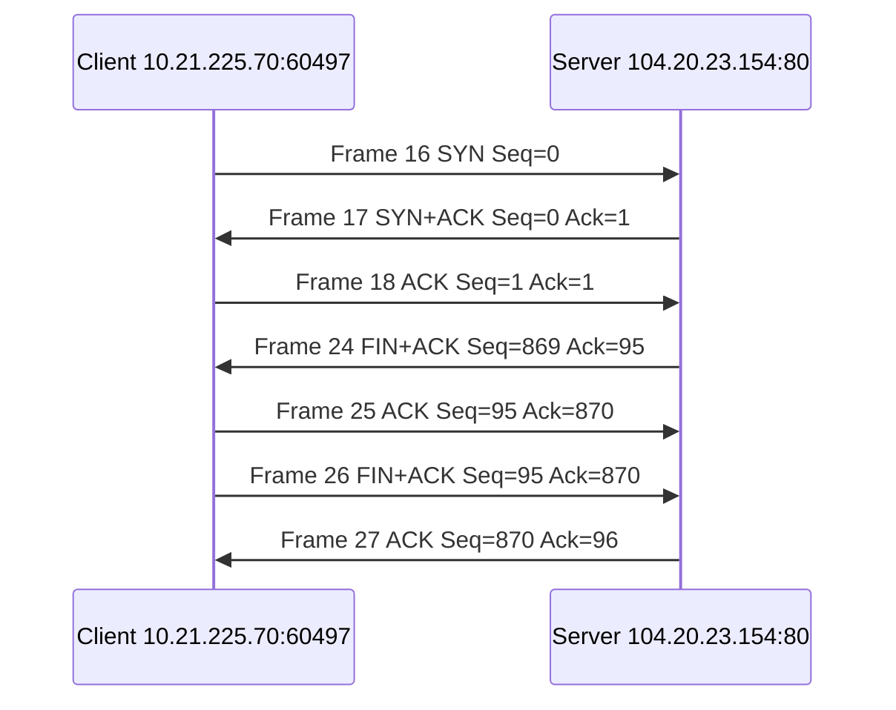

# 实验二 IP 和 TCP 数据分组的捕获和解析

> 学院：计算机学院（国家示范性软件学院）  
> 班级：304　学号：2024212936　姓名：刘文涛  
> 实验日期：2026 年 6 月 19 日

## 一、实验目的

1. 掌握 Wireshark 抓包、过滤、保存和字段展开方法。
2. 理解 DHCP 地址分配、ICMP 连通性测试、IPv4 分片重组和 TCP 连接管理。
3. 使用真实 pcap、CSV、Frame Number 和截图建立可追溯分析。

## 二、实验内容

完成 DHCP、ICMP、IPv4 分片和 TCP 三次握手/四次释放的捕获与分析，并使用 TShark 导出真实字段。

## 三、实验环境

| 项目 | 实际信息 |
|---|---|
| 操作系统 | Windows 11 25H2，64 位 |
| Wireshark/TShark | 4.6.6 |
| 网络接口 | WLAN，GUID `887FB422-3CDD-474F-AB19-69DDE6D65A61` |
| 本机 IP | `10.21.225.70/17` |
| 默认网关 | `10.21.128.1` |
| DNS | `10.3.9.4`、`10.3.9.5`、`10.3.9.6` |

## 四、实验总体方法

- DHCP：`udp port 67`；`dhcp || bootp`
- ICMP：`ping -4 -n 4 www.bupt.edu.cn`；`icmp`
- 分片：`ping -4 -n 1 -l 8000 10.21.128.1`；`ip.flags.mf == 1 || ip.frag_offset > 0`
- TCP：`curl.exe --noproxy "*" -4 -v --http1.1 -H "Connection: close" http://example.com/ -o NUL`；`tcp.stream == 2`

## 五、DHCP 报文捕获与分析

Frame 1 为 Release；Frame 2-5 的 Transaction ID 均为 `0xe83ab87a`，形成 Discover、Offer、Request、ACK。客户端未获得地址时使用源 IP `0.0.0.0`，并向 `255.255.255.255` 广播。服务器分配 `10.21.225.70`、掩码 `255.255.128.0`、网关 `10.21.128.1`、DNS 与 3600 秒租期。Renewal/Rebinding Time 在抓包中未携带。

## 六、ICMP 报文捕获与分析

捕获 4 组 Echo Request/Reply，Identifier 均为 1，Sequence 为 35-38，RTT 分别为 17.0278、4.4506、5.0747、9.7661 ms。Request Type=8，Reply Type=0，Code 均为 0。ICMP 直接封装在 IPv4 中，不使用 TCP/UDP 端口。

## 七、IP 数据报分片分析

Identification `0x299e` 的请求被分为 6 片，Offset 为 0、185、370、555、740、925。前五片 MF=1、Payload=1480，末片 MF=0、Payload=608。Offset 以 8 字节为单位，分片连续且无重叠，重组负载为 8008 字节。

## 八、TCP 建立连接与释放连接分析

采用 `tcp.stream == 2`，五元组为 `10.21.225.70:60497 -> 104.20.23.154:80/TCP`，使用 Wireshark Relative Sequence Number。

## 九、实验中遇到的问题与解决方法

包括接口选择错误、ICMP 捕获时机疑问、分片脚本字段兼容、TCP 首次缺少握手、捕获/显示过滤器混淆。所有问题均通过 pcap/CSV 复核、重抓或脚本修正解决。

## 十、实验总结与心得

四类正式抓包和自动校验全部通过。实验整体耗时超过 2-3 小时，主要用于网络环境核验、重抓、截图审计和字段一致性验证。实验进一步说明协议分析必须以真实报文为依据，不能用理论模板替代实际字段。

## 十一、附录

正式证据文件位于 `captures/`，字段表和分析位于 `exports/`，截图位于 `screenshots/`，最终 Word/PDF 位于 `report/`。
