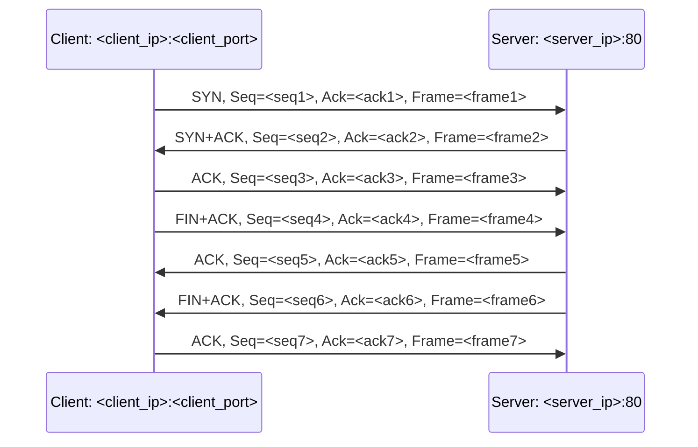

# 阶段 5：TCP 建立连接与释放连接捕获与分析

> 目标：捕获 TCP 三次握手和连接释放过程，分析 SYN、ACK、FIN、Seq、Ack，并生成消息序列图。  
> 输入：活跃网卡、Wireshark/tshark 可用。  
> 输出：`captures/tcp.pcapng`、`exports/tcp_fields.csv`、TCP 分析摘要、Mermaid 序列图、截图。

---

## 1. 实验目标

本阶段需要捕获：

```text
TCP 建立连接：
1. SYN
2. SYN + ACK
3. ACK

TCP 释放连接：
常见形式为 FIN + ACK、ACK、FIN + ACK、ACK
```

报告必须标明：

```text
SYN
ACK
FIN
发送序号 Seq
确认序号 Ack
源端口
目的端口
源 IP
目的 IP
```

---

## 2. 为什么建议使用 curl

很多网页默认使用 HTTPS，即 TCP 443 端口。实验要求通常关注 TCP port 80，因此直接用浏览器打开网页可能抓不到 `tcp port 80`。

建议使用明确的 HTTP 请求：

```bat
curl -4 -v --http1.1 -H "Connection: close" http://example.com/ -o NUL
```

如果 `example.com` 不合适，可改用：

```bat
curl -4 -v --http1.1 -H "Connection: close" http://neverssl.com/ -o NUL
```

`Connection: close` 有助于触发连接释放，便于观察 FIN。

---

## 3. Wireshark 抓包步骤

1. 打开 Wireshark。
2. 选择活跃网卡。
3. 在捕获过滤器中输入：

```text
tcp port 80
```

4. 开始捕获。
5. 打开 CMD。
6. 执行：

```bat
curl -4 -v --http1.1 -H "Connection: close" http://example.com/ -o NUL
```

7. 等待命令结束。
8. 停止捕获。
9. 保存为：

```text
captures/tcp.pcapng
```

---

## 4. Wireshark 显示过滤器

打开文件后使用：

```text
tcp.port == 80
```

找同一条 TCP 流：

```text
tcp.stream == 0
```

如果有多条流，逐个检查：

```text
tcp.stream == 1
tcp.stream == 2
```

也可以右键任一 TCP 包：

```text
Follow > TCP Stream
```

然后回到包列表，观察 Wireshark 自动设置的 `tcp.stream == n` 过滤条件。

---

## 5. 需要截图的内容

保存到 `screenshots/04_tcp/`：

```text
01_tcp_packet_list_port80.png
02_tcp_stream_filter.png
03_tcp_syn_detail.png
04_tcp_syn_ack_detail.png
05_tcp_ack_detail.png
06_tcp_fin_ack_detail.png
07_tcp_connection_release_list.png
08_follow_tcp_stream.png
```

截图要求：

- 包列表区能看到同一 TCP 流。
- 三次握手三个报文可见。
- 释放连接报文可见。
- TCP 详情区展开 Flags、Sequence Number、Acknowledgment Number。
- 如果 Wireshark 显示相对序号，应在报告中注明使用的是相对序号还是原始序号。

---

## 6. tshark 导出字段命令

```bat
tshark -r captures\tcp.pcapng -Y "tcp.port == 80" -T fields ^
  -E header=y -E separator=, -E quote=d ^
  -e frame.number ^
  -e frame.time_relative ^
  -e ip.src ^
  -e tcp.srcport ^
  -e ip.dst ^
  -e tcp.dstport ^
  -e tcp.stream ^
  -e tcp.flags ^
  -e tcp.flags.syn ^
  -e tcp.flags.ack ^
  -e tcp.flags.fin ^
  -e tcp.flags.reset ^
  -e tcp.seq ^
  -e tcp.ack ^
  -e tcp.len > exports\tcp_fields.csv
```

如需原始序号，可以尝试关闭相对序号或导出 raw 字段：

```bat
tshark -r captures\tcp.pcapng -Y "tcp.port == 80" -o tcp.relative_sequence_numbers:FALSE -T fields ^
  -E header=y -E separator=, -E quote=d ^
  -e frame.number ^
  -e frame.time_relative ^
  -e ip.src ^
  -e tcp.srcport ^
  -e ip.dst ^
  -e tcp.dstport ^
  -e tcp.stream ^
  -e tcp.flags ^
  -e tcp.flags.syn ^
  -e tcp.flags.ack ^
  -e tcp.flags.fin ^
  -e tcp.seq ^
  -e tcp.ack ^
  -e tcp.len > exports\tcp_fields_rawseq.csv
```

---

## 7. TCP 建连识别规则

Codex 需要在同一 `tcp.stream` 中找：

```text
第 1 个报文：SYN=1, ACK=0
第 2 个报文：SYN=1, ACK=1
第 3 个报文：SYN=0, ACK=1, FIN=0，且通常 tcp.len=0
```

理论关系：

```text
Client -> Server: SYN, Seq = x
Server -> Client: SYN+ACK, Seq = y, Ack = x + 1
Client -> Server: ACK, Seq = x + 1, Ack = y + 1
```

但报告中的 x、y 必须来自实际抓包字段。

---

## 8. TCP 释放识别规则

常见连接释放：

```text
A -> B: FIN+ACK
B -> A: ACK
B -> A: FIN+ACK
A -> B: ACK
```

但实际情况可能有变化：

```text
FIN 和 ACK 合并
客户端先关闭
服务器先关闭
出现 RST
连接被复用
没有捕获到完整释放过程
```

Codex 不能强行套模板，必须按抓包结果描述。

---

## 9. 报告表格格式

### 9.1 TCP 三次握手表

| 步骤 | Frame | Time | 方向 | Flags | Seq | Ack | Len | 说明 |
|---:|---:|---:|---|---|---:|---:|---:|---|
| 1 | 实际帧号 | 实际时间 | Client -> Server | SYN | 实际值 | 实际值或空 | 实际值 | 请求建立连接 |
| 2 | 实际帧号 | 实际时间 | Server -> Client | SYN, ACK | 实际值 | 实际值 | 实际值 | 同意建立连接 |
| 3 | 实际帧号 | 实际时间 | Client -> Server | ACK | 实际值 | 实际值 | 实际值 | 确认连接建立 |

### 9.2 TCP 连接释放表

| 步骤 | Frame | Time | 方向 | Flags | Seq | Ack | Len | 说明 |
|---:|---:|---:|---|---|---:|---:|---:|---|
| 1 | 实际帧号 | 实际时间 | A -> B | FIN, ACK | 实际值 | 实际值 | 实际值 | 主动关闭 |
| 2 | 实际帧号 | 实际时间 | B -> A | ACK | 实际值 | 实际值 | 实际值 | 确认关闭 |
| 3 | 实际帧号 | 实际时间 | B -> A | FIN, ACK | 实际值 | 实际值 | 实际值 | 被动方关闭 |
| 4 | 实际帧号 | 实际时间 | A -> B | ACK | 实际值 | 实际值 | 实际值 | 最终确认 |

---

## 10. Mermaid 序列图模板

Codex 需要用实际值替换占位符：



如果实际释放由服务器先发 FIN，图中方向必须相应调整。

---

## 11. TCP 阶段验收标准

```text
[ ] captures/tcp.pcapng 存在
[ ] exports/tcp_fields.csv 存在
[ ] 至少找到一个 tcp.stream
[ ] 同一 tcp.stream 中有 SYN、SYN+ACK、ACK
[ ] 尽量捕获到 FIN/ACK 释放过程；如没有，说明原因并重抓
[ ] 已生成 TCP 建连表
[ ] 已生成 TCP 释放表
[ ] 已生成 Mermaid 序列图
[ ] 至少 6 张关键截图已保存
[ ] 分析中没有虚构 Seq/Ack
```

---

## 12. 常见失败处理

### 12.1 没有 tcp port 80 包

处理：

```bat
curl -4 -v --http1.1 -H "Connection: close" http://example.com/ -o NUL
curl -4 -v --http1.1 -H "Connection: close" http://neverssl.com/ -o NUL
```

不要使用 `https://`。

### 12.2 只有建连，没有释放

处理：

1. 使用 `Connection: close`。
2. 等待 curl 完全结束后再停止抓包。
3. 多等 3 到 5 秒。
4. 避免浏览器复用连接。

### 12.3 出现 RST 而不是 FIN

可以记录为异常情况，但如果报告要求释放连接过程，建议重抓一次。

### 12.4 多条 TCP 流混杂

处理：

```text
tcp.stream == 0
tcp.stream == 1
tcp.stream == 2
```

选择最完整的一条进行分析。

---

## 13. 给 Codex 的提示语

```text
请执行阶段 5：TCP 建立连接与释放连接捕获与分析。

任务：
1. 检查 captures/tcp.pcapng 是否存在。
2. 如果不存在，请指导我使用 Wireshark 捕获过滤器 tcp port 80 开始抓包。
3. 指导我执行 curl -4 -v --http1.1 -H "Connection: close" http://example.com/ -o NUL；如果没有端口 80 包，改用 http://neverssl.com/。
4. 要求我停止捕获并保存为 captures/tcp.pcapng。
5. 使用 tshark 导出 exports/tcp_fields.csv。
6. 按 tcp.stream 分组，找出同时包含三次握手和连接释放过程的最完整流。
7. 整理 TCP 三次握手表：Frame、Time、方向、Flags、Seq、Ack、Len。
8. 整理 TCP 连接释放表：Frame、Time、方向、Flags、Seq、Ack、Len。
9. 生成 exports/tcp_sequence.mmd，使用 Mermaid sequenceDiagram，所有 Seq/Ack/Frame 均来自抓包。
10. 生成 exports/tcp_analysis.md，包含捕获过程、建连分析、释放分析、关键字段表、序列图、截图清单。
11. 如果没有完整 FIN 释放过程，请明确说明并指导我重新抓包，不能编造 FIN/ACK。

输出：
- 选中的 tcp.stream 编号。
- Client IP/Port 与 Server IP/Port。
- 三次握手表。
- 连接释放表。
- Mermaid 序列图路径。
- TCP 分析摘要路径。
- 截图清单。

禁止：
- 禁止虚构 Seq、Ack、Flags、Frame Number。
- 禁止把不同 tcp.stream 的报文混在同一个连接过程中分析。
```
