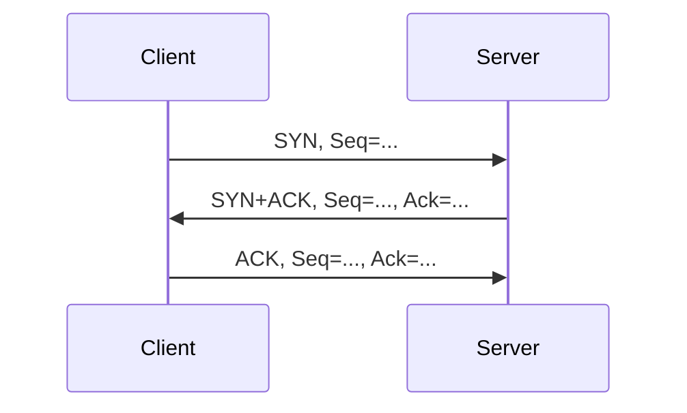

# 阶段 7：实验报告生成与截图整理

> 目标：基于真实抓包、CSV、截图，生成可审阅的实验报告 Markdown 初稿，并准备转换为 DOCX/PDF。  
> 输入：`exports/*.csv`、`exports/*_analysis.md`、截图目录。  
> 输出：`report/draft.md`、报告图表清单、待补项清单。

---

## 1. 报告结构

请使用以下结构：

```markdown
# 计算机网络实验二：IP 和 TCP 数据分组的捕获和解析

## 封面信息
- 实验名称：
- 学院：
- 班级：
- 学号：
- 姓名：
- 实验日期：

## 1. 实验内容和实验目的

## 2. 实验环境

## 3. 实验工具

## 4. DHCP 报文捕获与分析
### 4.1 捕获方法和过程
### 4.2 捕获结果
### 4.3 关键字段分析
### 4.4 DHCP 通信过程说明
### 4.5 小结

## 5. ICMP 报文捕获与分析
### 5.1 捕获方法和过程
### 5.2 捕获结果
### 5.3 ICMP 报文格式和字段功能
### 5.4 请求与响应匹配分析
### 5.5 小结

## 6. IP 数据报分片分析
### 6.1 捕获方法和过程
### 6.2 捕获结果
### 6.3 分片字段表
### 6.4 分片原理分析
### 6.5 小结

## 7. TCP 建立连接和释放连接分析
### 7.1 捕获方法和过程
### 7.2 TCP 流选择
### 7.3 三次握手分析
### 7.4 连接释放分析
### 7.5 消息序列图
### 7.6 小结

## 8. 实验过程中遇到的问题和解决方法

## 9. 实验总结和心得体会

## 附录：抓包文件和截图清单
```

---

## 2. 图表插入规范

报告中每个截图都应有图号和说明：

```markdown

```

表格应有标题：

```markdown
表 4-1 DHCP 关键报文字段表
```

TCP 序列图可以使用 Mermaid：



如果最终工具不支持 Mermaid，Codex 应将 Mermaid 导出为 PNG 或保留为代码块并在报告中说明。

---

## 3. 报告写作要求

Codex 写报告时必须：

1. 使用正式实验报告语气。
2. 所有字段值来自 CSV 或截图。
3. 每张表保留 Frame Number。
4. 对异常现象给出真实说明，不粉饰结果。
5. 理论说明和实验结果分开写。
6. 不把“预期过程”写成“实际捕获过程”。
7. 所有占位符用 `【待填写】` 标明，不编造班级、学号、姓名。

---

## 4. DHCP 小节写作要点

必须包含：

```text
捕获过滤器：udp port 67
显示过滤器：dhcp 或 bootp
触发命令：ipconfig /release、ipconfig /renew
分析对象：Release、Discover、Offer、Request、ACK
字段：Transaction ID、Client MAC、Your IP Address、Requested IP、Server Identifier、Lease Time
结论：说明 DHCP 如何完成动态地址分配
```

---

## 5. ICMP 小节写作要点

必须包含：

```text
显示过滤器：icmp
触发命令：ping -4 -n 4 目标
分析对象：Echo Request、Echo Reply
字段：Type、Code、Checksum、Identifier、Sequence Number、TTL、Protocol
结论：说明请求和响应如何通过 Identifier 和 Sequence 匹配
```

---

## 6. IP 分片小节写作要点

必须包含：

```text
触发命令：ping -4 -n 1 -l 8000 目标
显示过滤器：ip.flags.mf == 1 || ip.frag_offset > 0
字段：Total Length、Identification、DF、MF、Fragment Offset
结论：说明同一 Identification 的多个分片如何被接收端重组
```

---

## 7. TCP 小节写作要点

必须包含：

```text
捕获过滤器：tcp port 80
显示过滤器：tcp.port == 80 或 tcp.stream == n
触发命令：curl -4 -v --http1.1 -H "Connection: close" http://example.com/ -o NUL
字段：SYN、ACK、FIN、Seq、Ack、Len
表格：三次握手表、连接释放表
图：TCP 消息序列图
结论：说明 TCP 通过序号和确认号实现可靠连接管理
```

---

## 8. 问题与解决方法写作模板

Codex 可以根据实际情况选用并修改：

```markdown
## 8. 实验过程中遇到的问题和解决方法

### 8.1 DHCP 报文不完整

问题：第一次抓包时只捕获到部分 DHCP 报文，未形成完整的 Discover、Offer、Request、ACK 过程。  
原因分析：可能是抓包开始时间晚于地址申请过程，或选择的网络接口不是当前活跃接口。  
解决方法：重新选择 Wireshark 中有实时流量波形的接口，并在开始捕获后再执行 `ipconfig /release` 和 `ipconfig /renew`。重抓后获得完整 DHCP 过程。

### 8.2 TCP 端口 80 报文较少

问题：直接使用浏览器访问网页时，捕获到的 TCP 80 报文较少或没有。  
原因分析：现代网站常默认使用 HTTPS，实际连接端口为 443。  
解决方法：改用 `curl -4 -v --http1.1 -H "Connection: close" http://example.com/ -o NUL` 明确访问 HTTP 服务，并设置 `Connection: close` 以便观察连接释放过程。
```

如果实际没有遇到这些问题，不要写成真实问题。可以写“本次实验未遇到该问题”。

---

## 9. 总结心得写作模板

Codex 可基于实际结果扩写：

```markdown
## 9. 实验总结和心得体会

通过本次实验，我使用 Wireshark 捕获并分析了 DHCP、ICMP、IPv4 分片和 TCP 报文。实验中，DHCP 抓包展示了主机从释放地址到重新获取地址的过程，使我理解了动态地址分配中客户端和服务器的交互关系；ICMP 抓包展示了 Echo Request 和 Echo Reply 的匹配机制；IP 分片分析使我理解了 Identification、MF 和 Fragment Offset 在分片重组中的作用；TCP 抓包则直观展示了三次握手和连接释放过程中 SYN、ACK、FIN、Seq、Ack 字段的变化。

本次实验的关键收获是：协议分析不能只停留在理论流程上，而要结合实际报文的字段值进行验证。Wireshark 的捕获过滤器和显示过滤器作用不同，正确选择过滤方式可以显著提高分析效率。同时，在实际网络环境中，HTTPS、网卡卸载、目标主机策略等因素都可能影响抓包结果，因此实验过程中需要根据现象调整抓包目标和方法。
```

需要注意：如果某个协议抓包结果异常，心得中要如实说明。

---

## 10. 报告生成命令建议

如果使用 Pandoc：

```bat
pandoc report\draft.md -o report\计网实验2报告-班级-学号-姓名.docx
```

导出 PDF 可以：

```bat
pandoc report\draft.md -o report\计网实验2报告-班级-学号-姓名.pdf
```

如果 Pandoc 无法直接生成 PDF，可先生成 DOCX，然后用 Word 或 WPS 导出 PDF。

---

## 11. 本阶段验收标准

```text
[ ] report/draft.md 存在
[ ] 报告含封面信息占位符
[ ] 报告含实验环境
[ ] 报告含 DHCP、ICMP、IP 分片、TCP 四个分析章节
[ ] DHCP 章节有 DORA 流程和字段表
[ ] ICMP 章节有报文字段功能说明
[ ] IP 分片章节有所有分片字段表
[ ] TCP 章节有三次握手表、释放连接表、序列图
[ ] 问题与解决方法真实
[ ] 总结心得完整
[ ] 待补截图或字段以 TODO 明确标出
```

---

## 12. 给 Codex 的提示语

```text
请执行阶段 7：实验报告生成与截图整理。

任务：
1. 读取 exports/experiment_metadata.md、exports/analysis_summary.md，以及 DHCP、ICMP、IP 分片、TCP 的分析文件和 CSV。
2. 检查 screenshots 目录下是否存在所需截图。
3. 生成 report/draft.md，使用正式实验报告格式。
4. 报告结构必须包括：封面信息、实验内容和目的、实验环境、实验工具、DHCP 分析、ICMP 分析、IP 分片分析、TCP 建连和释放分析、问题与解决方法、总结心得、附录。
5. 所有协议字段值必须来自 CSV 或已有分析摘要。
6. 所有关键表格必须包含 Frame Number。
7. TCP 部分必须插入 Mermaid 消息序列图，或引用 exports/tcp_sequence.mmd。
8. 如果截图缺失，请在报告中用 TODO 标记，并单独输出待补截图清单。
9. 如果班级、学号、姓名未知，请使用【待填写】占位，不要编造。
10. 不要直接生成最终 PDF，先生成 Markdown 初稿供我审阅。

输出：
- report/draft.md
- 待补截图清单
- 待补字段清单
- 报告生成质量检查结果

禁止：
- 禁止虚构个人信息。
- 禁止虚构抓包字段。
- 禁止把未捕获到的报文写成已捕获。
```
