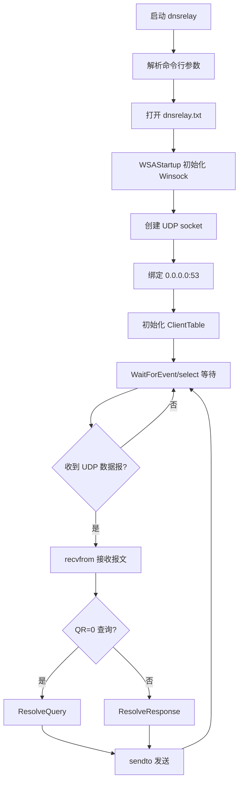
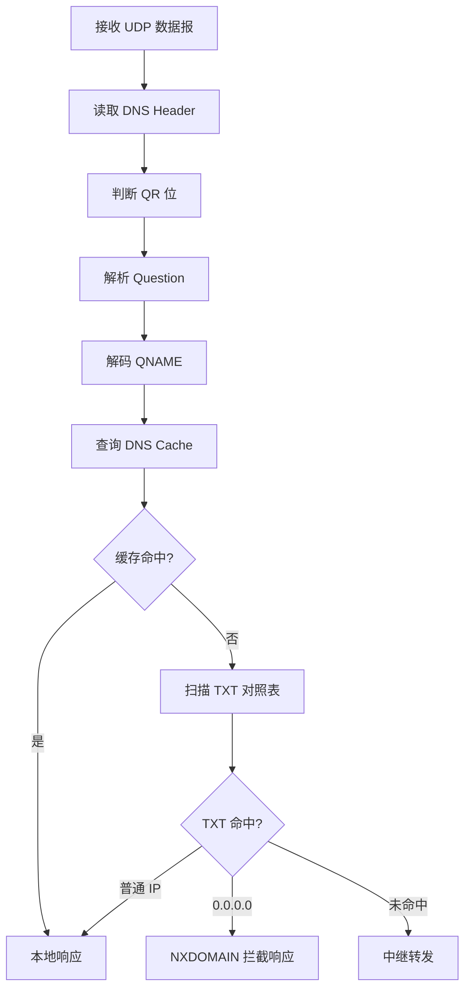
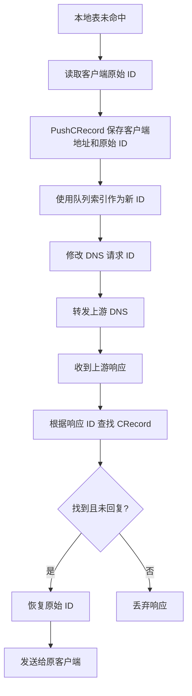
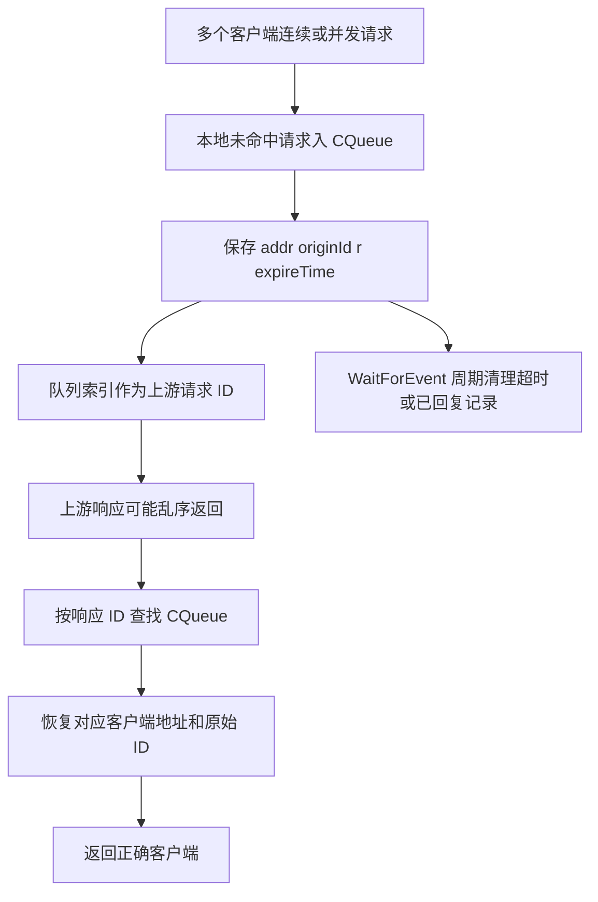

# DNS 中继服务器代码阅读与基础测试 README

> 本文档记录第二阶段“代码目录阅读、构建方式识别、基础构建与基础测试”的整理结果。  
> 目的不是生成最终实验报告，而是为后续实验报告撰写提供代码侧材料、测试侧材料和问题清单。

## 1. 阶段范围

### 1.1 代码目录

```text
C:\Users\28641\Desktop\计网\计网课设\dns-relay
```

### 1.2 资料与测试数据

```text
C:\Users\28641\Desktop\计网\计网课设\资料
```

本阶段测试使用的域名-IP 对照表为：

```text
C:\Users\28641\Desktop\计网\计网课设\资料\dnsrelay.txt
```

### 1.3 工作边界

本阶段完成了：

- 阅读代码目录结构。
- 阅读核心源代码文件。
- 分析构建方式。
- 使用 MinGW GCC 进行一次基础构建。
- 启动程序并执行基础 DNS 查询测试。
- 记录实际测试结果、代码实现情况和待确认问题。

本阶段未做：

- 未修改源代码。
- 未修复发现的问题。
- 未删除任何构建产物。
- 未生成最终实验报告。

## 2. 代码目录文件清单

| 文件路径 | 文件类型 | 主要用途 | 是否参与编译 | 是否与报告相关 | 是否进一步阅读 |
|---|---|---|---|---|---|
| `README.md` | 说明文档 | 项目框架、结构体说明、编码规范、待解决问题 | 否 | 是 | 已读 |
| `dnsrelay.sln` | Visual Studio 解决方案 | VS 工程入口 | 是，VS 构建 | 是 | 已读 |
| `source_code/source_code.vcxproj` | Visual Studio C 工程 | 声明参与编译的 `.c/.h` 文件 | 是 | 是 | 已读 |
| `source_code/source_code.vcxproj.filters` | VS 过滤器 | IDE 文件分组 | 否 | 否 | 已记录 |
| `source_code/dnsrelay.c` | C 源码 | 主程序、Winsock 初始化、UDP socket、select 主循环 | 是 | 是 | 已读 |
| `source_code/control.c` | C 源码 | 参数解析、调试输出、缓冲区清理 | 是 | 是 | 已读 |
| `source_code/control.h` | C 头文件 | 公共宏、全局变量声明、工具函数声明 | 是 | 是 | 已读 |
| `source_code/database.c` | C 源码 | 客户端 ID 映射队列、TXT 数据库、DNS 缓存 | 是 | 是 | 已读 |
| `source_code/database.h` | C 头文件 | `CRecord`、`CQueue`、常量和数据库接口 | 是 | 是 | 已读 |
| `source_code/resolve.c` | C 源码 | DNS 报文解析、本地响应构造、中继响应处理 | 是 | 是 | 已读 |
| `source_code/resolve.h` | C 头文件 | `DNSHeader` 和解析接口声明 | 是 | 是 | 已读 |
| `dnsrelay.exe` | 可执行文件 | 原有构建产物 | 否 | 可记录 | 不依赖 |
| `dnsrelay_gcc_build.exe` | 可执行文件 | 本阶段 GCC 构建产物 | 本次生成 | 是 | 已测试 |
| `images/design.jpg/png/svg` | 图片 | README 中的流程图素材 | 否 | 可选 | 可选 |
| `.vs/**` | Visual Studio 缓存 | IDE 中间数据 | 否 | 否 | 不读 |
| `.gitignore/.gitattributes/LICENSE` | 仓库元信息 | 版本控制和许可证信息 | 否 | 一般无关 | 不重点 |

补充说明：

- `dnsrelay.sln` 中 Solution Items 引用了 `source_code\dnsrelay.txt`。
- 实际检查时 `source_code\dnsrelay.txt` 不存在。
- 因此测试启动时必须显式传入 `..\资料\dnsrelay.txt`。

## 3. 构建方式与运行方式

### 3.1 项目构建方式

项目主要是 Windows C / Visual Studio 工程。

相关文件：

```text
dnsrelay.sln
source_code/source_code.vcxproj
```

工程文件中参与编译的源文件：

```text
control.c
database.c
dnsrelay.c
resolve.c
```

参与编译的头文件：

```text
control.h
database.h
resolve.h
```

工程配置：

- 工程名：`dnsrelay`
- 工程类型：Console Application
- 工具集：`v143`
- 平台：Win32 / x64
- 依赖：Windows Winsock，`ws2_32.lib`

### 3.2 实际测试环境

| 项目 | 实际值 |
|---|---|
| 操作系统 | Microsoft Windows NT 10.0.26200.0 |
| Shell | PowerShell 7.4.6 |
| 当前工作目录 | `C:\Users\28641\Desktop\计网\计网课设\dns-relay` |
| 可用编译器 | MinGW-w64 GCC 8.1.0 |
| 未找到 | `msbuild`、`cl`、`nmake` |
| 测试工具 | Python UDP DNS 查询脚本、Windows `nslookup` |
| 上游 DNS | `8.8.8.8` |
| 本机监听端口 | UDP 53 |

### 3.3 GCC 基础构建命令

由于当前环境 PATH 中未找到 Visual Studio 的 `msbuild` 或 `cl`，因此使用 MinGW GCC 进行基础构建。

执行命令：

```powershell
gcc -Wall -Wextra -std=c11 source_code\control.c source_code\database.c source_code\resolve.c source_code\dnsrelay.c -lws2_32 -o dnsrelay_gcc_build.exe
```

构建结果：

```text
构建成功，生成 dnsrelay_gcc_build.exe
```

生成文件：

```text
C:\Users\28641\Desktop\计网\计网课设\dns-relay\dnsrelay_gcc_build.exe
```

### 3.4 构建警告

GCC 构建时出现以下警告：

| 警告 | 位置 | 初步原因 | 报告价值 |
|---|---|---|---|
| `emptyBuffer` defined but not used | `control.c` | 定义了静态缓冲区常量但未使用 | 较低 |
| `domainName_ntop` 参数 signedness 不一致 | `resolve.c` | `char *` 与 `unsigned char *` 混用 | 中 |
| `inet_pton` implicit declaration | `resolve.c` | MinGW 环境下声明兼容问题 | 中 |
| `inet_ntop` implicit declaration | `resolve.c`, `dnsrelay.c` | MinGW 环境下声明兼容问题 | 中 |
| `#pragma comment` ignored | `dnsrelay.c` | 该指令是 MSVC 专用 | 高，适合说明 VS/GCC 差异 |

这些警告未阻止生成可执行文件，但说明项目主要面向 Visual Studio/MSVC 环境，跨编译器构建时需要注意兼容性。

### 3.5 启动命令

执行命令：

```powershell
.\dnsrelay_gcc_build.exe -d 8.8.8.8 ..\资料\dnsrelay.txt
```

启动关键输出：

```text
Debug level 1
Name server 8.8.8.8:53
Database using ..\资料\dnsrelay.txt
Socket() is OK!
Bind() is OK!
ClientTable init.
```

说明：

- 程序成功打开指定 TXT 对照表。
- 程序成功创建 UDP socket。
- 程序成功绑定 UDP 53 端口。
- 本次测试环境没有遇到 53 端口被占用或权限不足的问题。
- 程序不支持通过命令行修改本地监听端口，只能固定绑定 53。

## 4. 模块划分与职责

### 4.1 模块划分表

| 模块名称 | 对应文件 | 核心函数 | 输入 | 输出 | 主要职责 |
|---|---|---|---|---|---|
| 主程序控制模块 | `dnsrelay.c` | `main`, `WaitForEvent` | 命令行参数、UDP 报文 | 处理后的 UDP 报文 | 初始化、事件循环、收发调度 |
| Socket 通信模块 | `dnsrelay.c` | `socket`, `bind`, `recvfrom`, `sendto`, `select` | UDP 数据报 | UDP 响应或转发请求 | 创建和使用 UDP socket |
| 公共控制模块 | `control.c/h` | `dealOpts`, `debugPrintf`, `DebugBuffer`, `ClearBuffer` | 命令行参数、缓冲区 | 全局配置、日志输出 | 参数解析和调试输出 |
| DNS 报文解析模块 | `resolve.c/h` | `domainName_ntop`, `ResolveQuery` | DNS Query 报文 | 域名字符串、处理结果 | 解析 QNAME，判断处理路径 |
| DNS 响应构造模块 | `resolve.c/h` | `ResolveQuery` | 本地命中 IP | DNS Response 报文 | 构造 A 记录或 NXDOMAIN 响应 |
| 本地域名-IP 表模块 | `database.c/h` | `BuildDNSDatabase`, `FindInDNSDatabase` | TXT 文件、域名 | IP 或未命中 | 读取并查询域名-IP 对照表 |
| DNS 缓存模块 | `database.c/h` | `InsertIntoDNSCache`, `UpdateCache` | 域名、IP、TTL | 缓存命中或过期 | 缓存本地表和上游结果 |
| ID 映射与并发模块 | `database.c/h` | `PushCRecord`, `FindCRecord`, `SetCRecordR`, `PopCRecord` | 客户端地址、原始 ID | 新 ID、原地址、原始 ID | 维护中继请求映射 |

### 4.2 模块间关系

程序由 `dnsrelay.c` 中的 `main` 函数统一调度。启动时，`main` 首先调用 `dealOpts` 解析参数，然后调用 `BuildDNSDatabase` 打开本地域名-IP 对照表。随后程序初始化 Winsock，创建 UDP socket，并绑定本机 53 端口。

主循环由 `WaitForEvent` 和 `select` 驱动。每轮循环先维护缓存和 ID 映射队列，再等待 UDP 数据到达。收到报文后，程序根据 DNS Header 中 QR 位判断该报文是客户端查询还是上游响应。

如果是客户端查询，`ResolveQuery` 负责提取 QNAME，调用 `FindInDNSDatabase` 查询缓存和 TXT 表。如果命中本地记录，则直接构造响应；如果未命中，则调用 `PushCRecord` 保存客户端地址和原始 ID，并将请求转发到上游 DNS。

如果是上游响应，`ResolveResponse` 根据响应中的新 ID 查找 `CQueue` 中保存的客户端记录，恢复原始 ID 和客户端地址，再由 `sendto` 将响应发回原客户端。

## 5. 关键数据结构

| 数据结构/常量 | 定义位置 | 字段或值 | 所属模块 | 作用 | 适合写入报告 |
|---|---|---|---|---|---|
| `DNSHeader` | `resolve.h` | `ID`, `FLAGS`, `QDCOUNT`, `ANCOUNT`, `NSCOUNT`, `ARCOUNT` | DNS 报文解析 | 对应 DNS 固定 12 字节 Header | 是 |
| `CRecord` | `database.h` | `addr`, `originId`, `r`, `expireTime` | ID 映射 | 保存客户端地址、原始 ID、回复状态和超时 | 是 |
| `CQueue` | `database.h` | `base`, `front`, `rear` | ID 映射 | 循环队列，维护未完成中继请求 | 是 |
| `DNScache` | `database.c` | `domainName`, `ip`, `ttl` | 缓存模块 | 保存域名-IP 缓存项 | 是 |
| `MAX_BUFSIZE` | `control.h` | `512` | 公共控制 | DNS UDP 报文缓冲区大小 | 是 |
| `MAX_IP_BUFSIZE` | `control.h` | `16` | 公共控制 | IPv4 字符串缓冲区 | 是 |
| `MAX_DOMAINNAME` | `control.h` | `100` | 公共控制 | 域名缓冲区长度 | 是，作为潜在风险 |
| `TTL` | `control.h` | `120` | 缓存模块 | 本地缓存默认 TTL | 是 |
| `TIMEOUT` | `control.h` | `3` | ID 映射 | 上游响应等待超时秒数 | 是 |
| `MAX_QUERIES` | `database.h` | `25` | ID 映射 | 客户端查询队列容量，实际最多 24 个等待请求 | 是 |
| `MAX_CACHE_SIZE` | `database.h` | `100` | 缓存模块 | DNS 缓存最大条目数 | 是 |

## 6. 核心函数说明

### 6.1 `main`

位置：

```text
source_code/dnsrelay.c
```

功能：

- 解析命令行参数。
- 打开本地域名-IP 对照表。
- 初始化 Winsock。
- 创建 UDP socket。
- 绑定本地 53 端口。
- 初始化客户端查询表。
- 进入主循环，接收和处理 DNS 报文。

调用关系：

```text
main
 ├─ dealOpts
 ├─ BuildDNSDatabase
 ├─ WSAStartup
 ├─ socket
 ├─ bind
 ├─ InitCTable
 ├─ WaitForEvent
 ├─ recvfrom
 ├─ ResolveQuery / ResolveResponse
 └─ sendto
```

报告归属：

- 系统功能设计
- 模块划分
- 软件流程图

### 6.2 `WaitForEvent`

位置：

```text
source_code/dnsrelay.c
```

功能：

- 每轮循环调用 `UpdateCache` 更新 DNS 缓存 TTL。
- 检查 `ClientTable` 队首记录是否已回复或超时。
- 对已回复或超时记录调用 `PopCRecord` 移除。
- 使用 `select` 等待 UDP socket 可读事件。

实现特点：

- 程序不是多线程，而是单线程 `select` 事件循环。
- `select` 超时时间为 1 秒。
- 上游响应超时记录会被丢弃，不重新发送。

报告归属：

- Socket 通信模块
- ID 映射与并发处理模块
- 异常处理模块

### 6.3 `dealOpts`

位置：

```text
source_code/control.c
```

功能：

- 解析 `-d` 和 `-dd` 调试参数。
- 解析上游 DNS 服务器 IPv4 地址。
- 解析 `.txt` 结尾的数据库文件路径。

默认值：

```text
gDBtxt = "dnsrelay.txt"
addrDNSserv = "202.106.0.20"
gDebugLevel = 0
```

限制：

- 不支持指定本地监听端口。

报告归属：

- 主程序控制模块
- 测试环境说明

### 6.4 `BuildDNSDatabase`

位置：

```text
source_code/database.c
```

功能：

- 使用全局变量 `gDBtxt` 打开 TXT 格式域名-IP 对照表。
- 保存文件起始位置，用于每次查询前复位。

潜在问题：

- 代码中先调用 `fgetpos(dbTXT, &dbHome)`，再检查 `dbTXT` 是否为空。
- 如果文件不存在，可能存在空指针风险。

报告归属：

- 本地域名-IP 表模块
- 调试与待完善问题

### 6.5 `FindInDNSDatabase`

位置：

```text
source_code/database.c
```

功能：

- 先调用 `FindInDNSCache` 查内存缓存。
- 缓存未命中时扫描 TXT 文件。
- TXT 命中后调用 `InsertIntoDNSCache` 缓存结果。

重要实现：

- TXT 文件每行格式为 `IP 域名`。
- 域名比较使用 `strcmp`。

潜在问题：

- `strcmp` 大小写敏感，与 DNS 域名比较大小写不敏感的规范不一致。
- 基础测试已验证该问题：`WWW.5DSOFT.COM` 未命中本地屏蔽项，而是走上游中继。

报告归属：

- 本地域名-IP 表模块
- 测试用例
- 存在问题

### 6.6 `PushCRecord`

位置：

```text
source_code/database.c
```

功能：

- 将客户端地址、原始 ID、回复标记和过期时间写入循环队列。
- 将传入 ID 修改为当前队列索引。
- 队列索引用作转发给上游 DNS 的新 Transaction ID。

意义：

- 支持多个未完成的中继请求。
- 避免不同客户端或不同请求之间 ID 冲突。

报告归属：

- 消息 ID 转换
- 并发处理

### 6.7 `FindCRecord` 与 `SetCRecordR`

位置：

```text
source_code/database.c
```

功能：

- `FindCRecord` 根据新 ID 查找对应客户端记录。
- `SetCRecordR` 将记录标记为已回复。

作用：

- 上游响应返回后，根据响应 ID 找回原始客户端地址和原始 ID。
- 防止重复响应被多次转发。

报告归属：

- 中继转发模块
- ID 映射与并发处理模块

### 6.8 `domainName_ntop`

位置：

```text
source_code/resolve.c
```

功能：

- 将 DNS 报文中的 QNAME 标签编码转换为点分域名。
- 例如将 `03 www 07 example 03 com 00` 转换为 `www.example.com`。

限制：

- 未发现对压缩指针形式 QNAME 的处理。
- 未发现充分的边界检查。
- 由于普通 DNS Query 中 QNAME 通常不压缩，基础测试可正常工作。

报告归属：

- DNS 报文解析模块
- 调试问题

### 6.9 `ResolveQuery`

位置：

```text
source_code/resolve.c
```

功能：

- 提取客户端 DNS Query 中的 QNAME。
- 调用 `FindInDNSDatabase` 查本地缓存和 TXT 表。
- 命中普通 IP 时构造 A 记录响应。
- 命中 `0.0.0.0` 时构造 `RCODE=3` 响应。
- 未命中时调用 `PushCRecord` 记录客户端并转发上游 DNS。

本地 A 记录构造：

```text
NAME      = 0xC0 0x0C
TYPE      = 1
CLASS     = 1
TTL       = 120
RDLENGTH  = 4
RDATA     = IPv4 地址
```

报告归属：

- DNS 响应构造
- 本地解析
- 拦截功能
- 中继转发

### 6.10 `ResolveResponse`

位置：

```text
source_code/resolve.c
```

功能：

- 处理来自上游 DNS 的响应。
- 尝试提取域名、IP 和 TTL 并写入缓存。
- 根据响应中的新 ID 查找 `ClientTable`。
- 恢复客户端原始 ID。
- 将目标地址设为原始客户端地址。

潜在问题：

- 代码按固定偏移提取 IP 和 TTL，假定响应 Answer 类似 A 记录。
- 对 CNAME、MX、AAAA 或复杂压缩响应，缓存提取可能不准确。
- 基础测试中非 A 查询转发成功，但不建议报告中声称程序完整支持所有 RR 类型。

报告归属：

- 中继响应处理
- 缓存模块
- 待完善问题

## 7. 核心处理流程

### 7.1 程序启动流程

触发条件：

```powershell
.\dnsrelay_gcc_build.exe -d 8.8.8.8 ..\资料\dnsrelay.txt
```

流程：

```text
启动程序
  → dealOpts 解析参数
  → BuildDNSDatabase 打开 TXT 表
  → WSAStartup 初始化 Winsock
  → socket 创建 UDP socket
  → bind 绑定 0.0.0.0:53
  → InitCTable 初始化 ID 映射队列
  → 进入主循环
```

### 7.2 客户端 DNS 查询接收流程

流程：

```text
WaitForEvent 检测到 UDP 数据
  → recvfrom 接收报文
  → 读取 recvBuf[2] 的 QR 位
  → QR=0 判断为 Query
  → 调用 ResolveQuery
  → 解析 QNAME
  → 查询本地表或进入中继流程
```

### 7.3 本地表命中普通 IP 流程

流程：

```text
ResolveQuery
  → domainName_ntop 解码 QNAME
  → FindInDNSDatabase 命中普通 IP
  → 复制原始查询到 sendBuf
  → 设置 QR=1
  → 设置 RA=1
  → 设置 ANCOUNT=1
  → 追加 Answer RR
  → sendto 返回客户端
```

基础测试：

| 域名 | 返回结果 |
|---|---|
| `test1` | `11.111.11.111` |
| `test2` | `22.22.222.222` |
| `www.bupt.cn` | `123.127.134.10` |

### 7.4 本地表命中 `0.0.0.0` 拦截流程

流程：

```text
ResolveQuery
  → FindInDNSDatabase 命中 0.0.0.0
  → 设置 ANCOUNT=0
  → 设置 RCODE=3
  → 返回客户端
```

基础测试：

```text
test0 → RCODE=3, an=0
nslookup 输出 Non-existent domain
```

### 7.5 本地表未命中的中继流程

流程：

```text
ResolveQuery 未命中
  → 读取客户端原始 ID
  → PushCRecord 保存客户端地址和原始 ID
  → 使用队列索引作为新 ID
  → 修改 DNS Header ID
  → 将目标地址改为上游 DNS:53
  → sendto 转发上游 DNS
```

上游响应流程：

```text
收到上游 Response
  → ResolveResponse
  → 根据响应 ID 查找 CRecord
  → 恢复客户端原始 ID
  → 目标地址改回原客户端
  → sendto 返回客户端
```

基础测试：

| 域名 | 实际结果 |
|---|---|
| `www.example.com` | 返回 A 记录 |
| `www.baidu.com` | 返回 CNAME + A 记录 |

### 7.6 连续与并发查询流程

代码使用单线程 `select` 事件循环，并通过循环队列保存多个未完成的上游请求。

并发基础测试：

```text
10 个线程同时查询 10 个域名
全部返回
全部 id_match=True
```

说明基础规模下 ID 转换机制能够避免响应错配。

### 7.7 异常流程

代码中已发现的异常处理：

- `WSAStartup` 失败时退出。
- `socket` 创建失败时退出。
- `bind` 失败时退出。
- `recvfrom` 失败时记录日志并继续。
- `PushCRecord` 队列满时返回失败并丢弃请求。
- `FindCRecord` 找不到响应 ID 时丢弃响应。
- `WaitForEvent` 清理超时映射记录。

未充分覆盖或存在风险：

- 文件打开失败时 `BuildDNSDatabase` 有空指针风险。
- DNS 畸形报文缺少充分边界检查。
- QNAME 超长或异常编码可能导致越界。
- 非 A 响应缓存解析不健壮。

## 8. 与实验报告模板的对应关系

### 8.1 系统的功能设计

可写入报告的实际功能：

| 功能 | 代码实现位置 | 实现方式 | 是否测试 |
|---|---|---|---|
| DNS 请求监听 | `dnsrelay.c/main` | UDP socket 绑定 53 端口 | 已测试 |
| 域名解析 | `resolve.c/domainName_ntop` | 解析 DNS 标签编码 QNAME | 已测试普通查询 |
| 本地域名-IP 表查询 | `database.c/FindInDNSDatabase` | 缓存优先，未命中扫描 TXT | 已测试 |
| 不良网站拦截 | `resolve.c/ResolveQuery` | `0.0.0.0` 返回 `RCODE=3` | 已测试 |
| 普通 IP 直接响应 | `resolve.c/ResolveQuery` | 构造 A 记录 Answer | 已测试 |
| 未命中中继查询 | `resolve.c/ResolveQuery`, `ResolveResponse` | 修改 ID 后转发上游 DNS | 已测试 |
| 消息 ID 转换 | `database.c/PushCRecord`, `FindCRecord` | 队列索引作为新 ID | 已测试并发 |
| 连续/并发查询支持 | `dnsrelay.c/WaitForEvent`, `database.c/CQueue` | 单线程 select + ID 映射 | 已测试 |
| 日志输出 | `control.c/debugPrintf` | `-d/-dd` 控制日志 | 已观察 |
| 异常处理 | 多处 | socket 失败、队列满、超时清理 | 部分测试，部分代码阅读 |

### 8.2 模块划分

报告中可按以下模块写：

1. 主程序控制模块
2. Socket 通信模块
3. DNS 报文解析模块
4. DNS 响应构造模块
5. 本地域名-IP 表模块
6. DNS 缓存模块
7. 中继转发模块
8. ID 映射与并发处理模块
9. 日志与异常处理模块

### 8.3 软件流程图

可用于报告的流程图：

#### 8.3.1 程序总体流程图



#### 8.3.2 DNS 查询处理流程图



#### 8.3.3 中继与 ID 转换流程图



#### 8.3.4 并发查询处理流程图



### 8.4 测试用例以及运行结果

可直接纳入实验报告的测试表见第 9 节。

建议截图位置：

- 程序启动日志。
- `nslookup test1 127.0.0.1`。
- `nslookup test0 127.0.0.1`。
- `nslookup www.example.com 127.0.0.1`。
- Python 并发测试输出。

### 8.5 调试中遇到并解决的问题

可写入报告的问题：

- GCC 构建警告体现 MSVC 与 MinGW 差异。
- 默认数据库文件缺失，通过显式传入资料目录 `dnsrelay.txt` 解决测试启动。
- 大小写匹配未通过，作为代码待完善问题。
- 非 A 查询虽可转发，但缓存解析存在潜在风险。
- 53 端口权限在本次测试未阻碍，但在其他环境可能需要管理员权限。

### 8.6 心得体会素材

可围绕以下点展开：

- DNS 报文结构与 RFC1035 的对应关系。
- QNAME 标签编码、Answer RR、压缩指针的实现细节。
- UDP `recvfrom/sendto` 与客户端地址维护。
- Transaction ID 转换对并发查询的重要性。
- 网络程序测试需要结合日志、命令行工具和自定义脚本。
- 协议实现中边界条件和异常处理的重要性。

## 9. 基础测试执行记录

### 9.1 测试命令清单

```powershell
gcc --version
gcc -Wall -Wextra -std=c11 source_code\control.c source_code\database.c source_code\resolve.c source_code\dnsrelay.c -lws2_32 -o dnsrelay_gcc_build.exe
.\dnsrelay_gcc_build.exe -d 8.8.8.8 ..\资料\dnsrelay.txt
nslookup test1 127.0.0.1
nslookup test0 127.0.0.1
nslookup www.example.com 127.0.0.1
```

另使用 Python UDP DNS 查询脚本测试：

```text
test1
test2
test0
www.bupt.cn
www.example.com
www.baidu.com
www.5dsoft.com
WWW.5DSOFT.COM
www.example.com AAAA
example.com MX
连续查询
10 线程并发查询
```

### 9.2 启动日志摘要

```text
Debug level 1
Name server 8.8.8.8:53
Database using ..\资料\dnsrelay.txt
Socket() is OK!
Bind() is OK!
ClientTable init.
```

### 9.3 nslookup 输出摘要

#### 普通 IP 命中

命令：

```powershell
nslookup test1 127.0.0.1
```

关键结果：

```text
Name:    test1
Addresses:  11.111.11.111
```

#### 0.0.0.0 拦截

命令：

```powershell
nslookup test0 127.0.0.1
```

关键结果：

```text
*** UnKnown can't find test0: Non-existent domain
```

#### 未命中中继

命令：

```powershell
nslookup www.example.com 127.0.0.1
```

关键结果：

```text
Non-authoritative answer:
Name:    www.example.com
Addresses:  2606:4700:10::ac42:93f3
            2606:4700:10::6814:179a
            104.20.23.154
            172.66.147.243
```

## 10. 测试结果表

| 编号 | 测试类型 | 域名 | 预期结果 | 实际结果 | 是否通过 | 备注 |
|---|---|---|---|---|---|---|
| T1 | 构建测试 | - | 生成可执行文件 | 构建成功，有警告 | 通过 | 使用 MinGW GCC |
| T2 | 启动测试 | - | 成功监听 UDP 53 | `Socket() is OK! Bind() is OK!` | 通过 | 传入资料目录 TXT |
| T3 | 普通 IP 命中 | `test1` | `11.111.11.111` | 返回 `11.111.11.111` | 通过 | 本地 A 响应 |
| T4 | 普通 IP 命中 | `test2` | `22.22.222.222` | 返回 `22.22.222.222` | 通过 | 本地 A 响应 |
| T5 | 0.0.0.0 拦截 | `test0` | NXDOMAIN / `RCODE=3` | `rcode=3, an=0` | 通过 | 拦截功能 |
| T6 | 本地表命中 | `www.bupt.cn` | `123.127.134.10` | 返回该 IP | 通过 | 本地 A 响应 |
| T7 | 未命中中继 | `www.example.com` | 上游解析 | 返回 A 记录 | 通过 | 中继功能 |
| T8 | 未命中中继 | `www.baidu.com` | 上游解析 | 返回 CNAME + A | 通过 | 中继功能 |
| T9 | 大小写匹配 | `www.5dsoft.com` | 屏蔽 | NXDOMAIN | 通过 | 小写表项命中 |
| T10 | 大小写变体 | `WWW.5DSOFT.COM` | 按规范也应屏蔽 | 实际走上游并返回公网 IP | 未通过 | 代码大小写敏感 |
| T11 | 连续查询 | 混合 8 个域名 | 均正确响应 | 均响应 | 通过 | 连续处理 |
| T12 | 并发查询 | 10 个并发域名 | 不串包 | 全部 `id_match=True` | 通过 | ID 映射有效 |
| T13 | 非 A 查询 | `www.example.com AAAA` | 视实现而定 | 转发成功并返回 AAAA | 通过 | 仅说明可转发 |
| T14 | 非 A 查询 | `example.com MX` | 视实现而定 | 转发成功并返回 MX | 通过 | 缓存解析有风险 |
| T15 | 异常输入 | 畸形 DNS 报文 | 程序不崩溃 | 未执行 | 未完成 | 基础测试未覆盖 |

## 11. 发现的问题与待确认事项

### 11.1 实际发生的问题

| 问题 | 现象 | 原因 | 处理方式 |
|---|---|---|---|
| GCC 构建警告 | `inet_pton/inet_ntop` 隐式声明，`#pragma comment` 被忽略 | 工程主要面向 MSVC | 记录警告，未修改代码 |
| 默认数据库文件缺失 | `source_code\dnsrelay.txt` 不存在 | 工程引用与实际文件位置不一致 | 启动时显式传入 `..\资料\dnsrelay.txt` |
| 中文路径显示乱码 | 控制台显示 `..\����\dnsrelay.txt` | PowerShell/控制台编码问题 | 不影响文件打开和测试 |
| 大小写匹配未通过 | `WWW.5DSOFT.COM` 未命中本地屏蔽项 | TXT 查找使用 `strcmp` | 记录为待完善问题 |

### 11.2 代码阅读发现的潜在问题

| 问题 | 位置 | 说明 | 建议 |
|---|---|---|---|
| 文件打开失败风险 | `database.c/BuildDNSDatabase` | 先 `fgetpos` 后判断 `dbTXT` 是否为空 | 先判空再调用 `fgetpos` |
| 域名大小写敏感 | `database.c/FindIPByDNSinTXT` | 使用 `strcmp` | 改为大小写不敏感比较 |
| QNAME 边界检查不足 | `resolve.c/domainName_ntop` | 未充分检查长度和异常编码 | 增加长度边界和非法报文处理 |
| 域名缓冲区偏小 | `control.h/MAX_DOMAINNAME=100` | 小于 DNS 最大域名长度 253 | 扩大缓冲区并检查长度 |
| 复杂响应缓存风险 | `resolve.c/ResolveResponse` | 按固定 A 记录偏移提取 IP/TTL | 按 RR 格式解析 TYPE、CLASS、RDLENGTH |
| 队列实际容量 | `database.h/MAX_QUERIES=25` | 循环队列空一个位置，实际最多 24 条 | 报告中如实说明 |
| 非 A 查询支持范围 | `ResolveResponse` | 可转发但非完整解析支持 | 不声称完整支持全部 RR 类型 |

### 11.3 待确认事项

- 是否需要使用 Visual Studio 正式重新构建。
- 是否需要把 `dnsrelay.txt` 放入程序运行目录。
- 是否需要修复大小写不敏感匹配。
- 是否需要补充畸形报文、队列满、上游超时测试。
- 是否需要增加 Wireshark 抓包截图作为报告证据。

## 12. 后续生成实验报告可直接使用的材料

### 12.1 系统功能描述材料

本程序实现了一个基于 UDP 的 DNS 中继服务器，运行在 Windows 平台。程序监听本机 UDP 53 端口，接收客户端 DNS 查询请求，先在内存缓存和本地域名-IP 对照表中查找域名。如果命中普通 IP 地址，则直接构造 A 记录响应；如果命中 `0.0.0.0`，则返回 `RCODE=3`，表示域名不存在；如果本地未命中，则修改 DNS Transaction ID 后转发到上游 DNS 服务器，并在收到上游响应后恢复客户端原始 ID 返回。

### 12.2 模块描述材料

项目可分为主程序控制模块、Socket 通信模块、公共控制模块、DNS 报文解析模块、DNS 响应构造模块、本地域名-IP 表模块、DNS 缓存模块、ID 映射与并发处理模块。主程序负责整体调度，解析模块负责报文解析和响应构造，数据库模块负责查表和缓存，ID 映射模块负责保证中继响应能返回正确客户端。

### 12.3 测试结论材料

基础测试表明，程序能够成功构建并启动，能够完成普通 IP 本地解析、`0.0.0.0` 域名拦截、未命中域名中继查询、连续查询和小规模并发查询。测试中发现本地域名匹配对大小写敏感，导致大写变体未按 DNS 规范匹配本地表；非 A 查询可被转发，但代码中缓存解析逻辑不适合声称完整支持所有 RR 类型。

### 12.4 可写入“调试中遇到并解决的问题”的材料

- 构建环境中未找到 Visual Studio 编译器，改用 MinGW GCC 进行基础构建，并记录 MSVC/GCC 兼容性警告。
- 默认数据库文件不在代码目录，启动时显式指定资料目录下的 `dnsrelay.txt`。
- 通过测试发现域名大小写匹配存在规范差异。
- 通过阅读代码发现复杂 DNS 响应缓存解析存在潜在风险。

